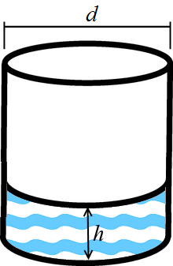

<h1 style='text-align: center;'> A. Pouring Rain</h1>

<h5 style='text-align: center;'>time limit per test: 1 second</h5>
<h5 style='text-align: center;'>memory limit per test: 256 megabytes</h5>

A lot of people in Berland hates rain, but you do not. Rain pacifies, puts your thoughts in order. By these years you have developed a good tradition — when it rains, you go on the street and stay silent for a moment, contemplate all around you, enjoy freshness, think about big deeds you have to do. 

Today everything had changed quietly. You went on the street with a cup contained water, your favorite drink. In a moment when you were drinking a water you noticed that the process became quite long: the cup still contained water because of rain. You decided to make a formal model of what was happening and to find if it was possible to drink all water in that situation. 

Thus, your cup is a cylinder with diameter equals *d* centimeters. Initial level of water in cup equals *h* centimeters from the bottom. 

  You drink a water with a speed equals *v* milliliters per second. But rain goes with such speed that if you do not drink a water from the cup, the level of water increases on *e* centimeters per second. The process of drinking water from the cup and the addition of rain to the cup goes evenly and continuously. 

Find the time needed to make the cup empty or find that it will never happen. It is guaranteed that if it is possible to drink all water, it will happen not later than after 104 seconds.

## Note

 one milliliter equals to one cubic centimeter.

## Input

The only line of the input contains four integer numbers *d*, *h*, *v*, *e* (1 ≤ *d*, *h*, *v*, *e* ≤ 104), where:

* *d* — the diameter of your cylindrical cup,
* *h* — the initial level of water in the cup,
* *v* — the speed of drinking process from the cup in milliliters per second,
* *e* — the growth of water because of rain if you do not drink from the cup.
## Output

If it is impossible to make the cup empty, print "NO" (without quotes).

Otherwise print "YES" (without quotes) in the first line. In the second line print a real number — time in seconds needed the cup will be empty. The answer will be considered correct if its relative or absolute error doesn't exceed 10- 4. It is guaranteed that if the answer exists, it doesn't exceed 104.

## Examples

## Input


```
1 2 3 100  

```
## Output


```
NO  

```
## Input


```
1 1 1 1  

```
## Output


```
YES  
3.659792366325  

```
## Note

In the first example the water fills the cup faster than you can drink from it.

In the second example area of the cup's bottom equals to , thus we can conclude that you decrease the level of water by  centimeters per second. At the same time water level increases by 1 centimeter per second due to rain. Thus, cup will be empty in  seconds.


#### tags 

#1100 #geometry #math 