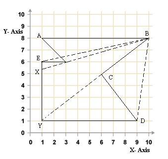
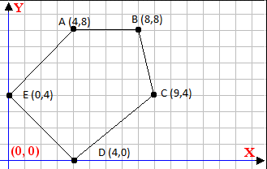

<h1 style='text-align: center;'> E. Save the City!</h1>

<h5 style='text-align: center;'>time limit per test: 1 second</h5>
<h5 style='text-align: center;'>memory limit per test: 256 megabytes</h5>

In the town of Aalam-Aara (meaning the Light of the Earth), previously there was no crime, no criminals but as the time progressed, sins started creeping into the hearts of once righteous people. Seeking solution to the problem, some of the elders found that as long as the corrupted part of population was kept away from the uncorrupted part, the crimes could be stopped. So, they are trying to set up a compound where they can keep the corrupted people. To ensure that the criminals don't escape the compound, a watchtower needs to be set up, so that they can be watched.

Since the people of Aalam-Aara aren't very rich, they met up with a merchant from some rich town who agreed to sell them a land-plot which has already a straight line fence *AB* along which a few points are set up where they can put up a watchtower. Your task is to help them find out the number of points on that fence where the tower can be put up, so that all the criminals can be watched from there. Only one watchtower can be set up. A criminal is watchable from the watchtower if the line of visibility from the watchtower to him doesn't cross the plot-edges at any point between him and the tower i.e. as shown in figure 1 below, points *X*, *Y*, *C* and *A* are visible from point *B* but the points *E* and *D* are not.

  Figure 1   Figure 2 Assume that the land plot is in the shape of a polygon and coordinate axes have been setup such that the fence *AB* is parallel to *x*-axis and the points where the watchtower can be set up are the integer points on the line. For example, in given figure 2, watchtower can be setup on any of five integer points on *AB* i.e. (4, 8), (5, 8), (6, 8), (7, 8) or (8, 8). You can assume that no three consecutive points are collinear and all the corner points other than *A* and *B*, lie towards same side of fence *AB*. The given polygon doesn't contain self-intersections.

## Input

The first line of the test case will consist of the number of vertices *n* (3 ≤ *n* ≤ 1000).

Next *n* lines will contain the coordinates of the vertices in the clockwise order of the polygon. On the *i*-th line are integers *x**i* and *y**i* (0 ≤ *x**i*, *y**i* ≤ 106) separated by a space.

The endpoints of the fence *AB* are the first two points, (*x*1, *y*1) and (*x*2, *y*2).

## Output

## Output

 consists of a single line containing the number of points where the watchtower can be set up.

## Examples

## Input


```
5  
4 8  
8 8  
9 4  
4 0  
0 4  

```
## Output


```
5  

```
## Input


```
5  
4 8  
5 8  
5 4  
7 4  
2 2  

```
## Output


```
0  

```
## Note

Figure 2 shows the first test case. All the points in the figure are watchable from any point on fence *AB*. Since, *AB* has 5 integer coordinates, so answer is 5.

For case two, fence *CD* and *DE* are not completely visible, thus answer is 0.


#### tags 

#2500 #geometry 