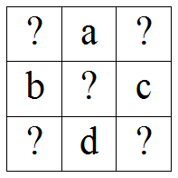
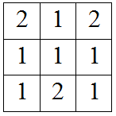
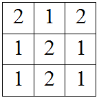
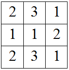
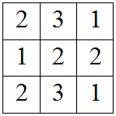
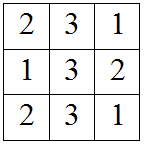
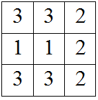
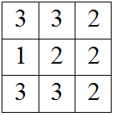
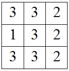

<h1 style='text-align: center;'> B. Restoring Painting</h1>

<h5 style='text-align: center;'>time limit per test: 1 second</h5>
<h5 style='text-align: center;'>memory limit per test: 256 megabytes</h5>

Vasya works as a watchman in the gallery. Unfortunately, one of the most expensive paintings was stolen while he was on duty. He doesn't want to be fired, so he has to quickly restore the painting. He remembers some facts about it.

* The painting is a square 3 × 3, each cell contains a single integer from 1 to *n*, and different cells may contain either different or equal integers.
* The sum of integers in each of four squares 2 × 2 is equal to the sum of integers in the top left square 2 × 2.
* Four elements *a*, *b*, *c* and *d* are known and are located as shown on the picture below.

Help Vasya find out the number of distinct squares the satisfy all the conditions above. ## Note

, that this number may be equal to 0, meaning Vasya remembers something wrong.

Two squares are considered to be different, if there exists a cell that contains two different integers in different squares.

## Input

The first line of the input contains five integers *n*, *a*, *b*, *c* and *d* (1 ≤ *n* ≤ 100 000, 1 ≤ *a*, *b*, *c*, *d* ≤ *n*) — maximum possible value of an integer in the cell and four integers that Vasya remembers.

## Output

Print one integer — the number of distinct valid squares.

## Examples

## Input


```
2 1 1 1 2  

```
## Output


```
2  

```
## Input


```
3 3 1 2 3  

```
## Output


```
6  

```
## Note

Below are all the possible paintings for the first sample.  

In the second sample, only paintings displayed below satisfy all the rules.      


#### tags 

#1400 #brute_force #constructive_algorithms #math 