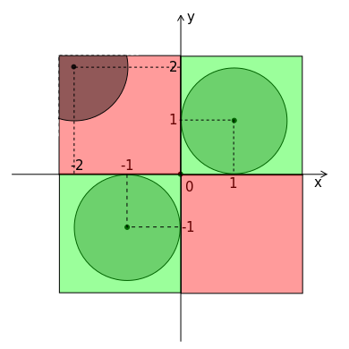

<h1 style='text-align: center;'> E. Runaway to a Shadow</h1>

<h5 style='text-align: center;'>time limit per test: 1 second</h5>
<h5 style='text-align: center;'>memory limit per test: 256 megabytes</h5>

Dima is living in a dormitory, as well as some cockroaches.

At the moment 0 Dima saw a cockroach running on a table and decided to kill it. Dima needs exactly *T* seconds for aiming, and after that he will precisely strike the cockroach and finish it.

To survive the cockroach has to run into a shadow, cast by round plates standing on the table, in *T* seconds. Shadow casted by any of the plates has the shape of a circle. Shadow circles may intersect, nest or overlap arbitrarily.

The cockroach uses the following strategy: first he equiprobably picks a direction to run towards and then runs towards it with the constant speed *v*. If at some moment *t* ≤ *T* it reaches any shadow circle, it immediately stops in the shadow and thus will stay alive. Otherwise the cockroach is killed by the Dima's precise strike. Consider that the Dima's precise strike is instant.

Determine the probability of that the cockroach will stay alive.

## Input

In the first line of the input the four integers *x*0, *y*0, *v*, *T* (|*x*0|, |*y*0| ≤ 109, 0 ≤ *v*, *T* ≤ 109) are given — the cockroach initial position on the table in the Cartesian system at the moment 0, the cockroach's constant speed and the time in seconds Dima needs for aiming respectively.

In the next line the only number *n* (1 ≤ *n* ≤ 100 000) is given — the number of shadow circles casted by plates.

In the next *n* lines shadow circle description is given: the *i**th* of them consists of three integers *x**i*, *y**i*, *r**i* (|*x**i*|, |*y**i*| ≤ 109, 0 ≤ *r* ≤ 109) — the *i**th* shadow circle on-table position in the Cartesian system and its radius respectively.

Consider that the table is big enough for the cockroach not to run to the table edges and avoid Dima's precise strike.

## Output

Print the only real number *p* — the probability of that the cockroach will stay alive.

Your answer will be considered correct if its absolute or relative error does not exceed 10- 4.

## Examples

## Input


```
0 0 1 1  
3  
1 1 1  
-1 -1 1  
-2 2 1  

```
## Output


```
0.50000000000
```
## Input


```
0 0 1 0  
1  
1 0 1  

```
## Output


```
1.00000000000
```
## Note

The picture for the first sample is given below. 

 Red color stands for points which being chosen as the cockroach's running direction will cause him being killed, green color for those standing for survival directions. Please note that despite containing a circle centered in ( - 2, 2) a part of zone is colored red because the cockroach is not able to reach it in one second.


#### tags 

#2500 #geometry #sortings 