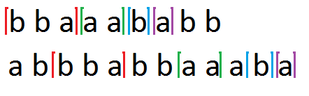

<h1 style='text-align: center;'> D. Alyona and Strings</h1>

<h5 style='text-align: center;'>time limit per test: 2 seconds</h5>
<h5 style='text-align: center;'>memory limit per test: 256 megabytes</h5>

After returned from forest, Alyona started reading a book. She noticed strings *s* and *t*, lengths of which are *n* and *m* respectively. As usual, reading bored Alyona and she decided to pay her attention to strings *s* and *t*, which she considered very similar.

Alyona has her favourite positive integer *k* and because she is too small, *k* does not exceed 10. The girl wants now to choose *k* disjoint non-empty substrings of string *s* such that these strings appear as disjoint substrings of string *t* and in the same order as they do in string *s*. She is also interested in that their length is maximum possible among all variants.

Formally, Alyona wants to find a sequence of *k* non-empty strings *p*1, *p*2, *p*3, ..., *p**k* satisfying following conditions:

* *s* can be represented as concatenation *a*1*p*1*a*2*p*2... *a**k**p**k**a**k* + 1, where *a*1, *a*2, ..., *a**k* + 1 is a sequence of arbitrary strings (some of them may be possibly empty);
* *t* can be represented as concatenation *b*1*p*1*b*2*p*2... *b**k**p**k**b**k* + 1, where *b*1, *b*2, ..., *b**k* + 1 is a sequence of arbitrary strings (some of them may be possibly empty);
* sum of the lengths of strings in sequence is maximum possible.

Please help Alyona solve this complicated problem and find at least the sum of the lengths of the strings in a desired sequence.

A substring of a string is a subsequence of consecutive characters of the string.

## Input

In the first line of the input three integers *n*, *m*, *k* (1 ≤ *n*, *m* ≤ 1000, 1 ≤ *k* ≤ 10) are given — the length of the string *s*, the length of the string *t* and Alyona's favourite number respectively.

The second line of the input contains string *s*, consisting of lowercase English letters.

The third line of the input contains string *t*, consisting of lowercase English letters.

## Output

In the only line print the only non-negative integer — the sum of the lengths of the strings in a desired sequence.

It is guaranteed, that at least one desired sequence exists.

## Examples

## Input


```
3 2 2  
abc  
ab  

```
## Output


```
2  

```
## Input


```
9 12 4  
bbaaababb  
abbbabbaaaba  

```
## Output


```
7  

```
## Note

The following image describes the answer for the second sample case:

 

#### tags 

#1900 #dp #strings 