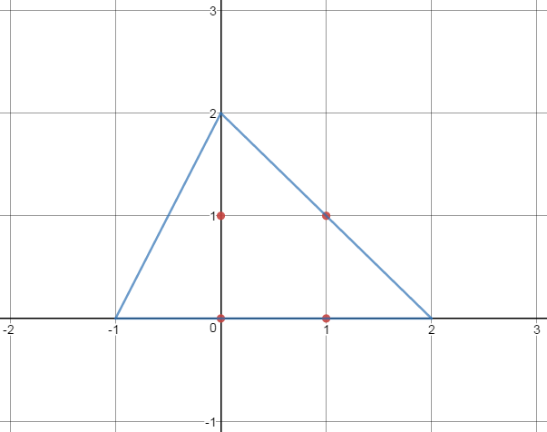

<h1 style='text-align: center;'> E. Alyona and Triangles</h1>

<h5 style='text-align: center;'>time limit per test: 3 seconds</h5>
<h5 style='text-align: center;'>memory limit per test: 256 megabytes</h5>

You are given *n* points with integer coordinates on the plane. Points are given in a way such that there is no triangle, formed by any three of these *n* points, which area exceeds *S*.

Alyona tried to construct a triangle with integer coordinates, which contains all *n* points and which area doesn't exceed 4*S*, but, by obvious reason, had no success in that. Please help Alyona construct such triangle. Please note that vertices of resulting triangle are not necessarily chosen from *n* given points.

## Input

In the first line of the input two integers *n* and *S* (3 ≤ *n* ≤ 5000, 1 ≤ *S* ≤ 1018) are given — the number of points given and the upper bound value of any triangle's area, formed by any three of given *n* points.

The next *n* lines describes given points: *i**th* of them consists of two integers *x**i* and *y**i* ( - 108 ≤ *x**i*, *y**i* ≤ 108) — coordinates of *i**th* point.

It is guaranteed that there is at least one triple of points not lying on the same line.

## Output

Print the coordinates of three points — vertices of a triangle which contains all *n* points and which area doesn't exceed 4*S*.

Coordinates of every triangle's vertex should be printed on a separate line, every coordinate pair should be separated by a single space. Coordinates should be an integers not exceeding 109 by absolute value.

It is guaranteed that there is at least one desired triangle. If there is more than one answer, print any of them.

## Example

## Input


```
4 1  
0 0  
1 0  
0 1  
1 1  

```
## Output


```
-1 0  
2 0  
0 2
```
## Note

 

#### tags 

#2600 #geometry #two_pointers 