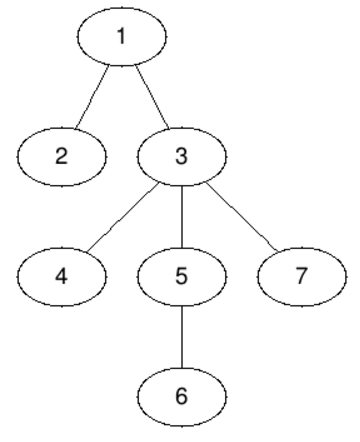

<h1 style='text-align: center;'> B. Kay and Snowflake</h1>

<h5 style='text-align: center;'>time limit per test: 3 seconds</h5>
<h5 style='text-align: center;'>memory limit per test: 256 megabytes</h5>

After the piece of a devilish mirror hit the Kay's eye, he is no longer interested in the beauty of the roses. Now he likes to watch snowflakes.

Once upon a time, he found a huge snowflake that has a form of the tree (connected acyclic graph) consisting of *n* nodes. The root of tree has index 1. Kay is very interested in the structure of this tree.

After doing some research he formed *q* queries he is interested in. The *i*-th query asks to find a centroid of the subtree of the node *v**i*. Your goal is to answer all queries.

Subtree of a node is a part of tree consisting of this node and all it's descendants (direct or not). In other words, subtree of node *v* is formed by nodes *u*, such that node *v* is present on the path from *u* to root.

Centroid of a tree (or a subtree) is a node, such that if we erase it from the tree, the maximum size of the connected component will be at least two times smaller than the size of the initial tree (or a subtree).

## Input

The first line of the input contains two integers *n* and *q* (2 ≤ *n* ≤ 300 000, 1 ≤ *q* ≤ 300 000) — the size of the initial tree and the number of queries respectively.

The second line contains *n* - 1 integer *p*2, *p*3, ..., *p**n* (1 ≤ *p**i* ≤ *n*) — the indices of the parents of the nodes from 2 to *n*. Node 1 is a root of the tree. It's guaranteed that *p**i* define a correct tree.

Each of the following *q* lines contain a single integer *v**i* (1 ≤ *v**i* ≤ *n*) — the index of the node, that define the subtree, for which we want to find a centroid.

## Output

For each query print the index of a centroid of the corresponding subtree. If there are many suitable nodes, print any of them. It's guaranteed, that each subtree has at least one centroid.

## Example

## Input


```
7 4  
1 1 3 3 5 3  
1  
2  
3  
5  

```
## Output


```
3  
2  
3  
6  

```
## Note

  The first query asks for a centroid of the whole tree — this is node 3. If we delete node 3 the tree will split in four components, two of size 1 and two of size 2.

The subtree of the second node consists of this node only, so the answer is 2.

Node 3 is centroid of its own subtree.

The centroids of the subtree of the node 5 are nodes 5 and 6 — both answers are considered correct.


#### tags 

#1900 #data_structures #dfs_and_similar #dp #trees 