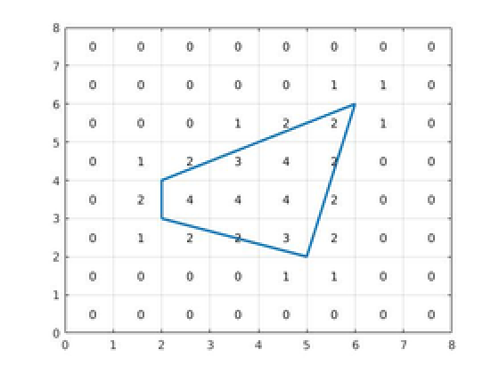

<h1 style='text-align: center;'> B2. Recover Polygon (medium)</h1>

<h5 style='text-align: center;'>time limit per test: 4 seconds</h5>
<h5 style='text-align: center;'>memory limit per test: 256 megabytes</h5>

Now that Heidi has made sure her Zombie Contamination level checker works, it's time to strike! This time, the zombie lair is a strictly convex polygon on the lattice. Each vertex of the polygon occupies a point on the lattice. For each cell of the lattice, Heidi knows the level of Zombie Contamination – the number of corners of the cell that are inside or on the border of the lair.

Given this information, Heidi wants to know the exact shape of the lair to rain destruction on the zombies. Help her!



## Input

The input contains multiple test cases.

The first line of each test case contains one integer *N*, the size of the lattice grid (5 ≤ *N* ≤ 500). The next *N* lines each contain *N* characters, describing the level of Zombie Contamination of each cell in the lattice. Every character of every line is a digit between 0 and 4. 

Cells are given in the same order as they are shown in the picture above: rows go in the decreasing value of *y* coordinate, and in one row cells go in the order of increasing *x* coordinate. This means that the first row corresponds to cells with coordinates (1, *N*), ..., (*N*, *N*) and the last row corresponds to cells with coordinates (1, 1), ..., (*N*, 1).

The last line of the file contains a zero. This line should not be treated as a test case. The sum of the *N* values for all tests in one file will not exceed 5000.

## Output

For each test case, give the following output:

The first line of the output should contain one integer *V*, the number of vertices of the polygon that is the secret lair. The next *V* lines each should contain two integers, denoting the vertices of the polygon in the clockwise order, starting from the lexicographically smallest vertex.

## Examples

## Input


```
8  
00000000  
00000110  
00012210  
01234200  
02444200  
01223200  
00001100  
00000000  
5  
00000  
01210  
02420  
01210  
00000  
7  
0000000  
0122100  
0134200  
0013200  
0002200  
0001100  
0000000  
0  

```
## Output


```
4  
2 3  
2 4  
6 6  
5 2  
4  
2 2  
2 3  
3 3  
3 2  
3  
2 5  
4 5  
4 2  

```
## Note

It is guaranteed that the solution always exists and is unique. It is guaranteed that in the correct solution the coordinates of the polygon vertices are between 2 and *N* - 2. A vertex (*x*1, *y*1) is lexicographically smaller than vertex (*x*2, *y*2) if *x*1 < *x*2 or .


#### tags 

#2600 #geometry 