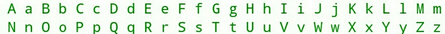

<h1 style='text-align: center;'> B. s-palindrome</h1>

<h5 style='text-align: center;'>time limit per test: 1 second</h5>
<h5 style='text-align: center;'>memory limit per test: 256 megabytes</h5>

Let's call a string "s-palindrome" if it is symmetric about the middle of the string. For example, the string "oHo" is "s-palindrome", but the string "aa" is not. The string "aa" is not "s-palindrome", because the second half of it is not a mirror reflection of the first half.

  English alphabet You are given a string *s*. Check if the string is "s-palindrome".

## Input

The only line contains the string *s* (1 ≤ |*s*| ≤ 1000) which consists of only English letters.

## Output

Print "TAK" if the string *s* is "s-palindrome" and "NIE" otherwise.

## Examples

## Input


```
oXoxoXo  

```
## Output


```
TAK  

```
## Input


```
bod  

```
## Output


```
TAK  

```
## Input


```
ER  

```
## Output


```
NIE  

```


#### tags 

#1600 #implementation #strings 