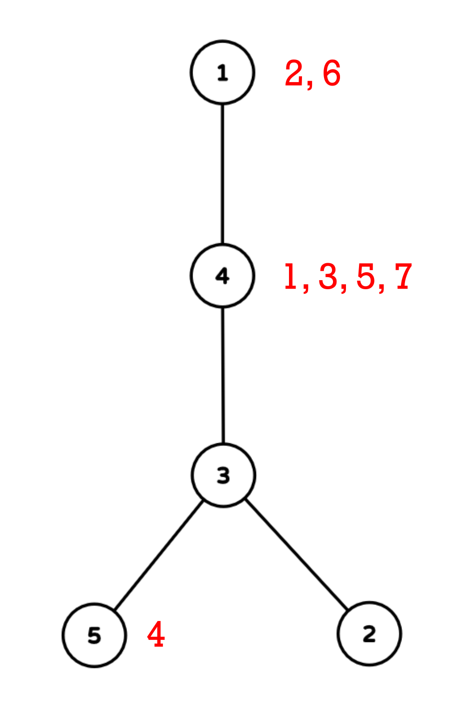

<h1 style='text-align: center;'> E. ...Wait for it...</h1>

<h5 style='text-align: center;'>time limit per test: 3 seconds</h5>
<h5 style='text-align: center;'>memory limit per test: 256 megabytes</h5>

Barney is searching for his dream girl. He lives in NYC. NYC has *n* junctions numbered from 1 to *n* and *n* - 1 roads connecting them. We will consider the NYC as a rooted tree with root being junction 1. *m* girls live in NYC, *i*-th of them lives along junction *c**i* and her weight initially equals *i* pounds.

  Barney consider a girl *x* to be better than a girl *y* if and only if: girl *x* has weight strictly less than girl *y* or girl *x* and girl *y* have equal weights and index of girl *x* living junction index is strictly less than girl *y* living junction index, i.e. *c**x* < *c**y*. Thus for any two girls one of them is always better than another one.

For the next *q* days, one event happens each day. There are two types of events:

1. Barney goes from junction *v* to junction *u*. As a result he picks at most *k* best girls he still have not invited from junctions on his way and invites them to his house to test if one of them is his dream girl. If there are less than *k* not invited girls on his path, he invites all of them.
2. Girls living along junctions in subtree of junction *v* (including *v* itself) put on some weight. As result, their weights increase by *k* pounds.

Your task is for each event of first type tell Barney the indices of girls he will invite to his home in this event.

## Input

The first line of input contains three integers *n*, *m* and *q* (1 ≤ *n*, *m*, *q* ≤ 105) — the number of junctions in NYC, the number of girls living in NYC and the number of events respectively.

The next *n* - 1 lines describes the roads. Each line contains two integers *v* and *u* (1 ≤ *v*, *u* ≤ *n*, *v* ≠ *u*) meaning that there is a road connecting junctions *v* and *u* .

The next line contains *m* integers *c*1, *c*2, ..., *c**m* (1 ≤ *c**i* ≤ *n*) — the girl's living junctions.

The next *q* lines describe the events in chronological order. Each line starts with an integer *t* (1 ≤ *t* ≤ 2) — type of the event .

If *t* = 1 then the line describes event of first type three integers *v*, *u* and *k* (1 ≤ *v*, *u*, *k* ≤ *n*) follow — the endpoints of Barney's path and the number of girls that he will invite at most.

Otherwise the line describes event of second type and two integers *v* and *k* (1 ≤ *v* ≤ *n*, 1 ≤ *k* ≤ 109) follow — the root of the subtree and value by which all the girls' weights in the subtree should increase.

## Output

For each event of the first type, print number *t* and then *t* integers *g*1, *g*2, ..., *g**t* in one line, meaning that in this event Barney will invite *t* girls whose indices are *g*1, ..., *g**t* in the order from the best to the worst according to Barney's considerations.

## Example

## Input


```
5 7 11  
3 5  
2 3  
4 3  
1 4  
4 1 4 5 4 1 4  
2 4 3  
1 2 1 2  
1 4 2 1  
2 2 10  
2 1 10  
1 2 4 1  
1 2 3 4  
2 5 2  
2 4 9  
1 3 5 2  
1 1 2 3  

```
## Output


```
2 2 1   
1 3   
1 5   
0   
1 4   
2 6 7   

```
## Note

For the first sample case:

  Description of events:

1. Weights of girls in subtree of junction 4 increase by 3. These girls have IDs: 1, 3, 5, 4, 7.
2. Barney goes from junction 2 to 1. Girls on his way have IDs 1, 2, 3, 5, 6, 7 with weights 4, 2, 6, 8, 6, 10 respectively. So, he invites girls 2 and 1.
3. Barney goes from junction 4 to junction 2. Girls on his way has IDs 3, 5, 7 with weights 6, 8, 10 respectively. So he invites girl 3.
4. Weight of girls in subtree of junction 2 increase by 10. There are no not invited girls, so nothing happens.
5. Weight of girls in subtree of junction 1 increase by 10. These girls (all girls left) have IDs: 4, 5, 6, 7.
6. Barney goes from junction 2 to junction 4. Girls on his way has IDs 5, 7 with weights 18, 20 respectively. So he invites girl 5.
7. Barney goes from junction 2 to junction 3. There is no girl on his way.
8. Weight of girls in subtree of junction 5 increase by 2. The only girl there is girl with ID 4.
9. Weight of girls in subtree of junction 4 increase by 9. These girls have IDs: 4, 6, 7.
10. Barney goes from junction 3 to junction 5. Only girl on his way is girl with ID 4.
11. Barney goes from junction 1 to junction 2. Girls on his way has IDs 6, 7 with weights 16, 29 respectively.


#### tags 

#3000 #data_structures #dsu #trees 