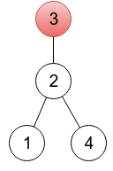

<h1 style='text-align: center;'> B. Fix a Tree</h1>

<h5 style='text-align: center;'>time limit per test: 2 seconds</h5>
<h5 style='text-align: center;'>memory limit per test: 256 megabytes</h5>

A tree is an undirected connected graph without cycles.

Let's consider a rooted undirected tree with *n* vertices, numbered 1 through *n*. There are many ways to represent such a tree. One way is to create an array with *n* integers *p*1, *p*2, ..., *p**n*, where *p**i* denotes a parent of vertex *i* (here, for convenience a root is considered its own parent).

  For this rooted tree the array *p* is [2, 3, 3, 2]. Given a sequence *p*1, *p*2, ..., *p**n*, one is able to restore a tree:

1. There must be exactly one index *r* that *p**r* = *r*. A vertex *r* is a root of the tree.
2. For all other *n* - 1 vertices *i*, there is an edge between vertex *i* and vertex *p**i*.

A sequence *p*1, *p*2, ..., *p**n* is called valid if the described procedure generates some (any) rooted tree. For example, for *n* = 3 sequences (1,2,2), (2,3,1) and (2,1,3) are not valid.

You are given a sequence *a*1, *a*2, ..., *a**n*, not necessarily valid. Your task is to change the minimum number of elements, in order to get a valid sequence. Print the minimum number of changes and an example of a valid sequence after that number of changes. If there are many valid sequences achievable in the minimum number of changes, print any of them.

## Input

The first line of the input contains an integer *n* (2 ≤ *n* ≤ 200 000) — the number of vertices in the tree.

The second line contains *n* integers *a*1, *a*2, ..., *a**n* (1 ≤ *a**i* ≤ *n*).

## Output

In the first line print the minimum number of elements to change, in order to get a valid sequence.

In the second line, print any valid sequence possible to get from (*a*1, *a*2, ..., *a**n*) in the minimum number of changes. If there are many such sequences, any of them will be accepted.

## Examples

## Input


```
4  
2 3 3 4  

```
## Output


```
1  
2 3 4 4   

```
## Input


```
5  
3 2 2 5 3  

```
## Output


```
0  
3 2 2 5 3   

```
## Input


```
8  
2 3 5 4 1 6 6 7  

```
## Output


```
2  
2 3 7 8 1 6 6 7  

```
## Note

In the first sample, it's enough to change one element. In the provided output, a sequence represents a tree rooted in a vertex 4 (because *p*4 = 4), which you can see on the left drawing below. One of other correct solutions would be a sequence 2 3 3 2, representing a tree rooted in vertex 3 (right drawing below). On both drawings, roots are painted red.

  In the second sample, the given sequence is already valid.


#### tags 

#1700 #constructive_algorithms #dfs_and_similar #dsu #graphs #trees 