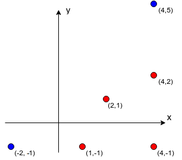

<h1 style='text-align: center;'> D. Limak and Shooting Points</h1>

<h5 style='text-align: center;'>time limit per test: 3 seconds</h5>
<h5 style='text-align: center;'>memory limit per test: 256 megabytes</h5>

Bearland is a dangerous place. Limak can’t travel on foot. Instead, he has *k* magic teleportation stones. Each stone can be used at most once. The *i*-th stone allows to teleport to a point (*ax**i*, *ay**i*). Limak can use stones in any order.

There are *n* monsters in Bearland. The *i*-th of them stands at (*mx**i*, *my**i*).

The given *k* + *n* points are pairwise distinct.

After each teleportation, Limak can shoot an arrow in some direction. An arrow will hit the first monster in the chosen direction. Then, both an arrow and a monster disappear. It’s dangerous to stay in one place for long, so Limak can shoot only one arrow from one place.

A monster should be afraid if it’s possible that Limak will hit it. How many monsters should be afraid of Limak?

## Input

The first line of the input contains two integers *k* and *n* (1 ≤ *k* ≤ 7, 1 ≤ *n* ≤ 1000) — the number of stones and the number of monsters.

The *i*-th of following *k* lines contains two integers *ax**i* and *ay**i* ( - 109 ≤ *ax**i*, *ay**i* ≤ 109) — coordinates to which Limak can teleport using the *i*-th stone.

The *i*-th of last *n* lines contains two integers *mx**i* and *my**i* ( - 109 ≤ *mx**i*, *my**i* ≤ 109) — coordinates of the *i*-th monster.

The given *k* + *n* points are pairwise distinct.

## Output

Print the number of monsters which should be afraid of Limak.

## Examples

## Input


```
2 4  
-2 -1  
4 5  
4 2  
2 1  
4 -1  
1 -1  

```
## Output


```
3  

```
## Input


```
3 8  
10 20  
0 0  
20 40  
300 600  
30 60  
170 340  
50 100  
28 56  
90 180  
-4 -8  
-1 -2  

```
## Output


```
5  

```
## Note

In the first sample, there are two stones and four monsters. Stones allow to teleport to points ( - 2,  - 1) and (4, 5), marked blue in the drawing below. Monsters are at (4, 2), (2, 1), (4,  - 1) and (1,  - 1), marked red. A monster at (4,  - 1) shouldn't be afraid because it's impossible that Limak will hit it with an arrow. Other three monsters can be hit and thus the answer is 3.

  In the second sample, five monsters should be afraid. Safe monsters are those at (300, 600), (170, 340) and (90, 180).


#### tags 

#2600 #brute_force #geometry #math 