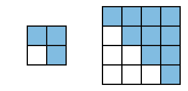
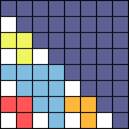

<h1 style='text-align: center;'> A. Cookies</h1>

<h5 style='text-align: center;'>time limit per test: 1 second</h5>
<h5 style='text-align: center;'>memory limit per test: 256 megabytes</h5>

Fangy collects cookies. Once he decided to take a box and put cookies into it in some way. If we take a square *k* × *k* in size, divided into blocks 1 × 1 in size and paint there the main diagonal together with cells, which lie above it, then the painted area will be equal to the area occupied by one cookie *k* in size. Fangy also has a box with a square base 2*n* × 2*n*, divided into blocks 1 × 1 in size. In a box the cookies should not overlap, and they should not be turned over or rotated. See cookies of sizes 2 and 4 respectively on the figure: 

   To stack the cookies the little walrus uses the following algorithm. He takes out of the repository the largest cookie which can fit in some place in the box and puts it there. Everything could be perfect but alas, in the repository the little walrus has infinitely many cookies of size 2 and larger, and there are no cookies of size 1, therefore, empty cells will remain in the box. Fangy wants to know how many empty cells will be left in the end.

## Input

The first line contains a single integer *n* (0 ≤ *n* ≤ 1000).

## Output

Print the single number, equal to the number of empty cells in the box. The answer should be printed modulo 106 + 3.

## Examples

## Input


```
3  

```
## Output


```
9
```
## Note

If the box possesses the base of 23 × 23 (as in the example), then the cookies will be put there in the following manner: 



#### tags 

#1300 #math 