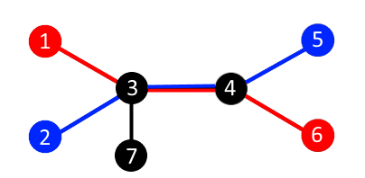

<h1 style='text-align: center;'> B. Connecting Universities</h1>

<h5 style='text-align: center;'>time limit per test: 3 seconds</h5>
<h5 style='text-align: center;'>memory limit per test: 256 megabytes</h5>

Treeland is a country in which there are *n* towns connected by *n* - 1 two-way road such that it's possible to get from any town to any other town. 

In Treeland there are 2*k* universities which are located in different towns. 

Recently, the president signed the decree to connect universities by high-speed network.The Ministry of Education understood the decree in its own way and decided that it was enough to connect each university with another one by using a cable. Formally, the decree will be done! 

To have the maximum sum in the budget, the Ministry decided to divide universities into pairs so that the total length of the required cable will be maximum. In other words, the total distance between universities in *k* pairs should be as large as possible. 

Help the Ministry to find the maximum total distance. Of course, each university should be present in only one pair. Consider that all roads have the same length which is equal to 1. 

## Input

The first line of the input contains two integers *n* and *k* (2 ≤ *n* ≤ 200 000, 1 ≤ *k* ≤ *n* / 2) — the number of towns in Treeland and the number of university pairs. Consider that towns are numbered from 1 to *n*. 

The second line contains 2*k* distinct integers *u*1, *u*2, ..., *u*2*k* (1 ≤ *u**i* ≤ *n*) — indices of towns in which universities are located. 

The next *n* - 1 line contains the description of roads. Each line contains the pair of integers *x**j* and *y**j* (1 ≤ *x**j*, *y**j* ≤ *n*), which means that the *j*-th road connects towns *x**j* and *y**j*. All of them are two-way roads. You can move from any town to any other using only these roads. 

## Output

Print the maximum possible sum of distances in the division of universities into *k* pairs.

## Examples

## Input


```
7 2  
1 5 6 2  
1 3  
3 2  
4 5  
3 7  
4 3  
4 6  

```
## Output


```
6  

```
## Input


```
9 3  
3 2 1 6 5 9  
8 9  
3 2  
2 7  
3 4  
7 6  
4 5  
2 1  
2 8  

```
## Output


```
9  

```
## Note

The figure below shows one of possible division into pairs in the first test. If you connect universities number 1 and 6 (marked in red) and universities number 2 and 5 (marked in blue) by using the cable, the total distance will equal 6 which will be the maximum sum in this example. 

  

#### tags 

#1800 #dfs_and_similar #dp #graphs #trees 