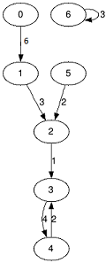

<h1 style='text-align: center;'> E. Analysis of Pathes in Functional Graph</h1>

<h5 style='text-align: center;'>time limit per test: 2 seconds</h5>
<h5 style='text-align: center;'>memory limit per test: 512 megabytes</h5>

You are given a functional graph. It is a directed graph, in which from each vertex goes exactly one arc. The vertices are numerated from 0 to *n* - 1.

Graph is given as the array *f*0, *f*1, ..., *f**n* - 1, where *f**i* — the number of vertex to which goes the only arc from the vertex *i*. Besides you are given array with weights of the arcs *w*0, *w*1, ..., *w**n* - 1, where *w**i* — the arc weight from *i* to *f**i*.

  The graph from the first sample test. Also you are given the integer *k* (the length of the path) and you need to find for each vertex two numbers *s**i* and *m**i*, where:

* *s**i* — the sum of the weights of all arcs of the path with length equals to *k* which starts from the vertex *i*;
* *m**i* — the minimal weight from all arcs on the path with length *k* which starts from the vertex *i*.

The length of the path is the number of arcs on this path.

## Input

The first line contains two integers *n*, *k* (1 ≤ *n* ≤ 105, 1 ≤ *k* ≤ 1010). The second line contains the sequence *f*0, *f*1, ..., *f**n* - 1 (0 ≤ *f**i* < *n*) and the third — the sequence *w*0, *w*1, ..., *w**n* - 1 (0 ≤ *w**i* ≤ 108).

## Output

Print *n* lines, the pair of integers *s**i*, *m**i* in each line.

## Examples

## Input


```
7 3  
1 2 3 4 3 2 6  
6 3 1 4 2 2 3  

```
## Output


```
10 1  
8 1  
7 1  
10 2  
8 2  
7 1  
9 3  

```
## Input


```
4 4  
0 1 2 3  
0 1 2 3  

```
## Output


```
0 0  
4 1  
8 2  
12 3  

```
## Input


```
5 3  
1 2 3 4 0  
4 1 2 14 3  

```
## Output


```
7 1  
17 1  
19 2  
21 3  
8 1  

```


#### tags 

#2100 #data_structures #graphs 