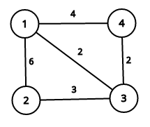
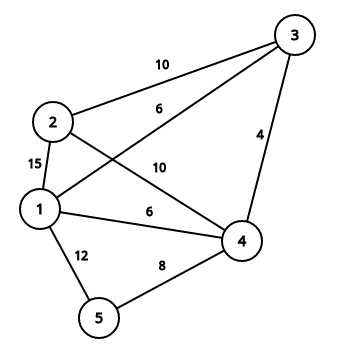

<h1 style='text-align: center;'> B. Mishka and trip</h1>

<h5 style='text-align: center;'>time limit per test: 1 second</h5>
<h5 style='text-align: center;'>memory limit per test: 256 megabytes</h5>

Little Mishka is a great traveller and she visited many countries. After thinking about where to travel this time, she chose XXX — beautiful, but little-known northern country.

Here are some interesting facts about XXX:

1. XXX consists of *n* cities, *k* of whose (just imagine!) are capital cities.
2. All of cities in the country are beautiful, but each is beautiful in its own way. Beauty value of *i*-th city equals to *c**i*.
3. All the cities are consecutively connected by the roads, including 1-st and *n*-th city, forming a cyclic route 1 — 2 — ... — *n* — 1. Formally, for every 1 ≤ *i* < *n* there is a road between *i*-th and *i* + 1-th city, and another one between 1-st and *n*-th city.
4. Each capital city is connected with each other city directly by the roads. Formally, if city *x* is a capital city, then for every 1 ≤ *i* ≤ *n*,  *i* ≠ *x*, there is a road between cities *x* and *i*.
5. There is at most one road between any two cities.
6. Price of passing a road directly depends on beauty values of cities it connects. Thus if there is a road between cities *i* and *j*, price of passing it equals *c**i*·*c**j*.

Mishka started to gather her things for a trip, but didn't still decide which route to follow and thus she asked you to help her determine summary price of passing each of the roads in XXX. Formally, for every pair of cities *a* and *b* (*a* < *b*), such that there is a road between *a* and *b* you are to find sum of products *c**a*·*c**b*. Will you help her?

## Input

The first line of the input contains two integers *n* and *k* (3 ≤ *n* ≤ 100 000, 1 ≤ *k* ≤ *n*) — the number of cities in XXX and the number of capital cities among them.

The second line of the input contains *n* integers *c*1, *c*2, ..., *c**n* (1 ≤ *c**i* ≤ 10 000) — beauty values of the cities.

The third line of the input contains *k* distinct integers *id*1, *id*2, ..., *id**k* (1 ≤ *id**i* ≤ *n*) — indices of capital cities. Indices are given in ascending order.

## Output

Print the only integer — summary price of passing each of the roads in XXX.

## Examples

## Input


```
4 1  
2 3 1 2  
3  

```
## Output


```
17
```
## Input


```
5 2  
3 5 2 2 4  
1 4  

```
## Output


```
71
```
## Note

This image describes first sample case:



It is easy to see that summary price is equal to 17.

This image describes second sample case:



It is easy to see that summary price is equal to 71.


#### tags 

#1400 #implementation #math 