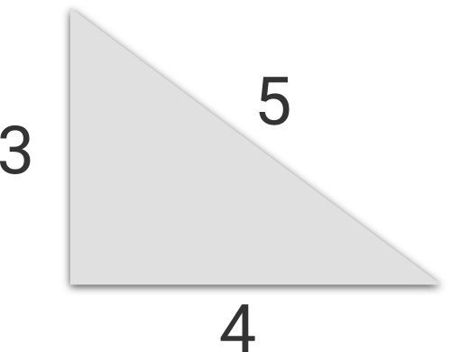

<h1 style='text-align: center;'> C. Pythagorean Triples</h1>

<h5 style='text-align: center;'>time limit per test: 1 second</h5>
<h5 style='text-align: center;'>memory limit per test: 256 megabytes</h5>

Katya studies in a fifth grade. Recently her class studied right triangles and the Pythagorean theorem. It appeared, that there are triples of positive integers such that you can construct a right triangle with segments of lengths corresponding to triple. Such triples are called Pythagorean triples.

For example, triples (3, 4, 5), (5, 12, 13) and (6, 8, 10) are Pythagorean triples.

Here Katya wondered if she can specify the length of some side of right triangle and find any Pythagorean triple corresponding to such length? ## Note

 that the side which length is specified can be a cathetus as well as hypotenuse.

Katya had no problems with completing this task. Will you do the same?

## Input

The only line of the input contains single integer *n* (1 ≤ *n* ≤ 109) — the length of some side of a right triangle.

## Output

Print two integers *m* and *k* (1 ≤ *m*, *k* ≤ 1018), such that *n*, *m* and *k* form a Pythagorean triple, in the only line.

In case if there is no any Pythagorean triple containing integer *n*, print  - 1 in the only line. If there are many answers, print any of them.

## Examples

## Input


```
3  

```
## Output


```
4 5
```
## Input


```
6  

```
## Output


```
8 10
```
## Input


```
1  

```
## Output


```
-1
```
## Input


```
17  

```
## Output


```
144 145
```
## Input


```
67  

```
## Output


```
2244 2245
```
## Note

Illustration for the first sample.


#### tags 

#1500 #math #number_theory 