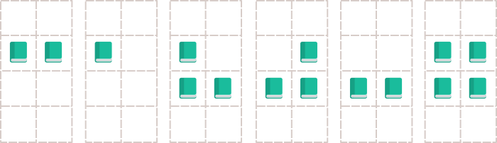

<h1 style='text-align: center;'> D. Persistent Bookcase </h1>

<h5 style='text-align: center;'>time limit per test: 2 seconds</h5>
<h5 style='text-align: center;'>memory limit per test: 512 megabytes</h5>

Recently in school Alina has learned what are the persistent data structures: they are data structures that always preserves the previous version of itself and access to it when it is modified.

After reaching home Alina decided to invent her own persistent data structure. Inventing didn't take long: there is a bookcase right behind her bed. Alina thinks that the bookcase is a good choice for a persistent data structure. Initially the bookcase is empty, thus there is no book at any position at any shelf.

The bookcase consists of *n* shelves, and each shelf has exactly *m* positions for books at it. Alina enumerates shelves by integers from 1 to *n* and positions at shelves — from 1 to *m*. Initially the bookcase is empty, thus there is no book at any position at any shelf in it.

Alina wrote down *q* operations, which will be consecutively applied to the bookcase. Each of the operations has one of four types:

* 1 *i* *j* — Place a book at position *j* at shelf *i* if there is no book at it.
* 2 *i* *j* — Remove the book from position *j* at shelf *i* if there is a book at it.
* 3 *i* — Invert book placing at shelf *i*. This means that from every position at shelf *i* which has a book at it, the book should be removed, and at every position at shelf *i* which has not book at it, a book should be placed.
* 4 *k* — Return the books in the bookcase in a state they were after applying *k*-th operation. In particular, *k* = 0 means that the bookcase should be in initial state, thus every book in the bookcase should be removed from its position.

After applying each of operation Alina is interested in the number of books in the bookcase. Alina got 'A' in the school and had no problem finding this values. Will you do so?

## Input

The first line of the input contains three integers *n*, *m* and *q* (1 ≤ *n*, *m* ≤ 103, 1 ≤ *q* ≤ 105) — the bookcase dimensions and the number of operations respectively.

The next *q* lines describes operations in chronological order — *i*-th of them describes *i*-th operation in one of the four formats described in the statement.

It is guaranteed that shelf indices and position indices are correct, and in each of fourth-type operation the number *k* corresponds to some operation before it or equals to 0.

## Output

For each operation, print the number of books in the bookcase after applying it in a separate line. The answers should be printed in chronological order.

## Examples

## Input


```
2 3 3  
1 1 1  
3 2  
4 0  

```
## Output


```
1  
4  
0  

```
## Input


```
4 2 6  
3 2  
2 2 2  
3 3  
3 2  
2 2 2  
3 2  

```
## Output


```
2  
1  
3  
3  
2  
4  

```
## Input


```
2 2 2  
3 2  
2 2 1  

```
## Output


```
2  
1  

```
## Note

This image illustrates the second sample case.


#### tags 

#2200 #bitmasks #data_structures #dfs_and_similar #implementation 