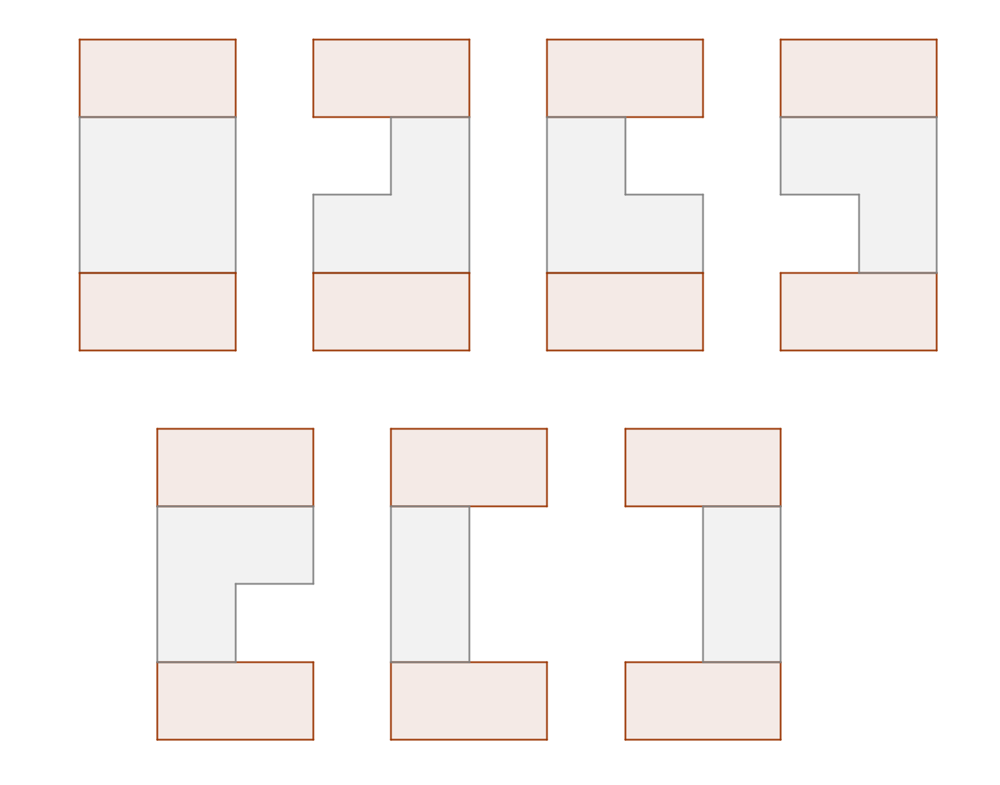

<h1 style='text-align: center;'> E. Student's Camp</h1>

<h5 style='text-align: center;'>time limit per test: 3 seconds</h5>
<h5 style='text-align: center;'>memory limit per test: 256 megabytes</h5>

Alex studied well and won the trip to student camp Alushta, located on the seashore. 

Unfortunately, it's the period of the strong winds now and there is a chance the camp will be destroyed! Camp building can be represented as the rectangle of *n* + 2 concrete blocks height and *m* blocks width.

Every day there is a breeze blowing from the sea. Each block, except for the blocks of the upper and lower levers, such that there is no block to the left of it is destroyed with the probability . Similarly, each night the breeze blows in the direction to the sea. Thus, each block (again, except for the blocks of the upper and lower levers) such that there is no block to the right of it is destroyed with the same probability *p*. ## Note

, that blocks of the upper and lower level are indestructible, so there are only *n*·*m* blocks that can be destroyed.

The period of the strong winds will last for *k* days and *k* nights. If during this period the building will split in at least two connected components, it will collapse and Alex will have to find another place to spend summer.

Find the probability that Alex won't have to look for other opportunities and will be able to spend the summer in this camp.

## Input

The first line of the input contains two integers *n* and *m* (1 ≤ *n*, *m* ≤ 1500) that define the size of the destructible part of building.

The second line of the input contains two integers *a* and *b* (1 ≤ *a* ≤ *b* ≤ 109) that define the probability *p*. It's guaranteed that integers *a* and *b* are coprime. 

The third line contains a single integer *k* (0 ≤ *k* ≤ 100 000) — the number of days and nights strong wind will blow for.

## Output

Consider the answer as an irreducible fraction is equal to . Print one integer equal to . It's guaranteed that within the given constraints .

## Examples

## Input


```
2 2  
1 2  
1  

```
## Output


```
937500007  

```
## Input


```
5 1  
3 10  
1  

```
## Output


```
95964640  

```
## Input


```
3 3  
1 10  
5  

```
## Output


```
927188454  

```
## Note

In the first sample, each of the four blocks is destroyed with the probability . There are 7 scenarios that result in building not collapsing, and the probability we are looking for is equal to , so you should print 

  

#### tags 

#3100 #dp #math 