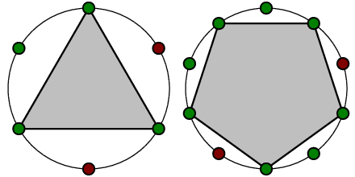

<h1 style='text-align: center;'> C. Round Table Knights</h1>

<h5 style='text-align: center;'>time limit per test: 0.5 second</h5>
<h5 style='text-align: center;'>memory limit per test: 256 megabytes</h5>

There are *n* knights sitting at the Round Table at an equal distance from each other. Each of them is either in a good or in a bad mood.

Merlin, the wizard predicted to King Arthur that the next month will turn out to be particularly fortunate if the regular polygon can be found. On all vertices of the polygon knights in a good mood should be located. Otherwise, the next month will bring misfortunes.

A convex polygon is regular if all its sides have same length and all his angles are equal. In this problem we consider only regular polygons with at least 3 vertices, i. e. only nondegenerated.

On a picture below some examples of such polygons are present. Green points mean knights in a good mood. Red points mean ones in a bad mood.

  King Arthur knows the knights' moods. Help him find out if the next month will be fortunate or not.

## Input

The first line contains number *n*, which is the number of knights at the round table (3 ≤ *n* ≤ 105). The second line contains space-separated moods of all the *n* knights in the order of passing them around the table. "1" means that the knight is in a good mood an "0" means that he is in a bad mood.

## Output

Print "YES" without the quotes if the following month will turn out to be lucky. Otherwise, print "NO".

## Examples

## Input


```
3  
1 1 1  

```
## Output


```
YES
```
## Input


```
6  
1 0 1 1 1 0  

```
## Output


```
YES
```
## Input


```
6  
1 0 0 1 0 1  

```
## Output


```
NO
```


#### tags 

#1600 #dp #math #number_theory 