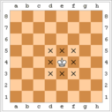

<h1 style='text-align: center;'> A. King Moves</h1>

<h5 style='text-align: center;'>time limit per test: 1 second</h5>
<h5 style='text-align: center;'>memory limit per test: 256 megabytes</h5>

The only king stands on the standard chess board. You are given his position in format "cd", where *c* is the column from 'a' to 'h' and *d* is the row from '1' to '8'. Find the number of moves permitted for the king.

Check the king's moves here <https://en.wikipedia.org/wiki/King_(chess)>.

  King moves from the position e4 ## Input

The only line contains the king's position in the format "cd", where 'c' is the column from 'a' to 'h' and 'd' is the row from '1' to '8'.

## Output

Print the only integer *x* — the number of moves permitted for the king.

## Example

## Input


```
e4  

```
## Output


```
8  

```


#### tags 

#800 #implementation 