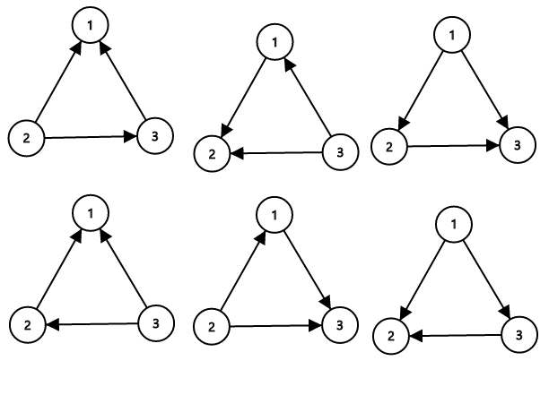

<h1 style='text-align: center;'> D. Directed Roads</h1>

<h5 style='text-align: center;'>time limit per test: 2 seconds</h5>
<h5 style='text-align: center;'>memory limit per test: 256 megabytes</h5>

ZS the Coder and Chris the Baboon has explored Udayland for quite some time. They realize that it consists of *n* towns numbered from 1 to *n*. 

There are *n* directed roads in the Udayland. *i*-th of them goes from town *i* to some other town *a**i* (*a**i* ≠ *i*). ZS the Coder can flip the direction of any road in Udayland, i.e. if it goes from town *A* to town *B* before the flip, it will go from town *B* to town *A* after.

ZS the Coder considers the roads in the Udayland confusing, if there is a sequence of distinct towns *A*1, *A*2, ..., *A**k* (*k* > 1) such that for every 1 ≤ *i* < *k* there is a road from town *A**i* to town *A**i* + 1 and another road from town *A**k* to town *A*1. In other words, the roads are confusing if some of them form a directed cycle of some towns.

Now ZS the Coder wonders how many sets of roads (there are 2*n* variants) in initial configuration can he choose to flip such that after flipping each road in the set exactly once, the resulting network will not be confusing.

## Note

 that it is allowed that after the flipping there are more than one directed road from some town and possibly some towns with no roads leading out of it, or multiple roads between any pair of cities.

## Input

The first line of the input contains single integer *n* (2 ≤ *n* ≤ 2·105) — the number of towns in Udayland.

The next line contains *n* integers *a*1, *a*2, ..., *a**n* (1 ≤ *a**i* ≤ *n*, *a**i* ≠ *i*), *a**i* denotes a road going from town *i* to town *a**i*.

## Output

Print a single integer — the number of ways to flip some set of the roads so that the resulting whole set of all roads is not confusing. Since this number may be too large, print the answer modulo 109 + 7.

## Examples

## Input


```
3  
2 3 1  

```
## Output


```
6  

```
## Input


```
4  
2 1 1 1  

```
## Output


```
8  

```
## Input


```
5  
2 4 2 5 3  

```
## Output


```
28  

```
## Note

Consider the first sample case. There are 3 towns and 3 roads. The towns are numbered from 1 to 3 and the roads are , ,  initially. Number the roads 1 to 3 in this order. 

The sets of roads that ZS the Coder can flip (to make them not confusing) are {1}, {2}, {3}, {1, 2}, {1, 3}, {2, 3}. ## Note

 that the empty set is invalid because if no roads are flipped, then towns 1, 2, 3 is form a directed cycle, so it is confusing. Similarly, flipping all roads is confusing too. Thus, there are a total of 6 possible sets ZS the Coder can flip.

The sample image shows all possible ways of orienting the roads from the first sample such that the network is not confusing.




#### tags 

#1900 #combinatorics #dfs_and_similar #graphs #math 