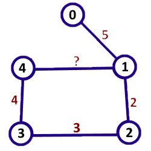

<h1 style='text-align: center;'> B. Complete The Graph</h1>

<h5 style='text-align: center;'>time limit per test: 4 seconds</h5>
<h5 style='text-align: center;'>memory limit per test: 256 megabytes</h5>

ZS the Coder has drawn an undirected graph of *n* vertices numbered from 0 to *n* - 1 and *m* edges between them. Each edge of the graph is weighted, each weight is a positive integer.

The next day, ZS the Coder realized that some of the weights were erased! So he wants to reassign positive integer weight to each of the edges which weights were erased, so that the length of the shortest path between vertices *s* and *t* in the resulting graph is exactly *L*. Can you help him?

## Input

The first line contains five integers *n*, *m*, *L*, *s*, *t* (2 ≤ *n* ≤ 1000,  1 ≤ *m* ≤ 10 000,  1 ≤ *L* ≤ 109,  0 ≤ *s*, *t* ≤ *n* - 1,  *s* ≠ *t*) — the number of vertices, number of edges, the desired length of shortest path, starting vertex and ending vertex respectively.

Then, *m* lines describing the edges of the graph follow. *i*-th of them contains three integers, *u**i*, *v**i*, *w**i* (0 ≤ *u**i*, *v**i* ≤ *n* - 1,  *u**i* ≠ *v**i*,  0 ≤ *w**i* ≤ 109). *u**i* and *v**i* denote the endpoints of the edge and *w**i* denotes its weight. If *w**i* is equal to 0 then the weight of the corresponding edge was erased.

It is guaranteed that there is at most one edge between any pair of vertices.

## Output

Print "NO" (without quotes) in the only line if it's not possible to assign the weights in a required way.

Otherwise, print "YES" in the first line. Next *m* lines should contain the edges of the resulting graph, with weights assigned to edges which weights were erased. *i*-th of them should contain three integers *u**i*, *v**i* and *w**i*, denoting an edge between vertices *u**i* and *v**i* of weight *w**i*. The edges of the new graph must coincide with the ones in the graph from the input. The weights that were not erased must remain unchanged whereas the new weights can be any positive integer not exceeding 1018. 

The order of the edges in the output doesn't matter. The length of the shortest path between *s* and *t* must be equal to *L*.

If there are multiple solutions, print any of them.

## Examples

## Input


```
5 5 13 0 4  
0 1 5  
2 1 2  
3 2 3  
1 4 0  
4 3 4  

```
## Output


```
YES  
0 1 5  
2 1 2  
3 2 3  
1 4 8  
4 3 4  

```
## Input


```
2 1 123456789 0 1  
0 1 0  

```
## Output


```
YES  
0 1 123456789  

```
## Input


```
2 1 999999999 1 0  
0 1 1000000000  

```
## Output


```
NO  

```
## Note

Here's how the graph in the first sample case looks like :

  In the first sample case, there is only one missing edge weight. Placing the weight of 8 gives a shortest path from 0 to 4 of length 13.

In the second sample case, there is only a single edge. Clearly, the only way is to replace the missing weight with 123456789.

In the last sample case, there is no weights to assign but the length of the shortest path doesn't match the required value, so the answer is "NO".


#### tags 

#2300 #binary_search #constructive_algorithms #graphs #shortest_paths 