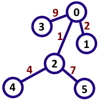
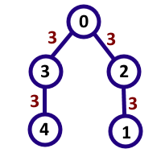

<h1 style='text-align: center;'> C. Digit Tree</h1>

<h5 style='text-align: center;'>time limit per test: 3 seconds</h5>
<h5 style='text-align: center;'>memory limit per test: 256 megabytes</h5>

ZS the Coder has a large tree. It can be represented as an undirected connected graph of *n* vertices numbered from 0 to *n* - 1 and *n* - 1 edges between them. There is a single nonzero digit written on each edge.

One day, ZS the Coder was bored and decided to investigate some properties of the tree. He chose a positive integer *M*, which is coprime to 10, i.e. .

ZS consider an ordered pair of distinct vertices (*u*, *v*) interesting when if he would follow the shortest path from vertex *u* to vertex *v* and write down all the digits he encounters on his path in the same order, he will get a decimal representaion of an integer divisible by *M*.

Formally, ZS consider an ordered pair of distinct vertices (*u*, *v*) interesting if the following states true:

* Let *a*1 = *u*, *a*2, ..., *a**k* = *v* be the sequence of vertices on the shortest path from *u* to *v* in the order of encountering them;
* Let *d**i* (1 ≤ *i* < *k*) be the digit written on the edge between vertices *a**i* and *a**i* + 1;
* The integer  is divisible by *M*.

Help ZS the Coder find the number of interesting pairs!

## Input

The first line of the input contains two integers, *n* and *M* (2 ≤ *n* ≤ 100 000, 1 ≤ *M* ≤ 109, ) — the number of vertices and the number ZS has chosen respectively.

The next *n* - 1 lines contain three integers each. *i*-th of them contains *u**i*, *v**i* and *w**i*, denoting an edge between vertices *u**i* and *v**i* with digit *w**i* written on it (0 ≤ *u**i*, *v**i* < *n*,  1 ≤ *w**i* ≤ 9).

## Output

Print a single integer — the number of interesting (by ZS the Coder's consideration) pairs.

## Examples

## Input


```
6 7  
0 1 2  
4 2 4  
2 0 1  
3 0 9  
2 5 7  

```
## Output


```
7  

```
## Input


```
5 11  
1 2 3  
2 0 3  
3 0 3  
4 3 3  

```
## Output


```
8  

```
## Note

In the first sample case, the interesting pairs are (0, 4), (1, 2), (1, 5), (3, 2), (2, 5), (5, 2), (3, 5). The numbers that are formed by these pairs are 14, 21, 217, 91, 7, 7, 917 respectively, which are all multiples of 7. ## Note

 that (2, 5) and (5, 2) are considered different. 

  In the second sample case, the interesting pairs are (4, 0), (0, 4), (3, 2), (2, 3), (0, 1), (1, 0), (4, 1), (1, 4), and 6 of these pairs give the number 33 while 2 of them give the number 3333, which are all multiples of 11.

  

#### tags 

#2700 #dfs_and_similar #divide_and_conquer #dsu #trees 