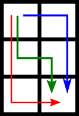

<h1 style='text-align: center;'> D. Create a Maze</h1>

<h5 style='text-align: center;'>time limit per test: 2 seconds</h5>
<h5 style='text-align: center;'>memory limit per test: 256 megabytes</h5>

ZS the Coder loves mazes. Your job is to create one so that he can play with it. A maze consists of *n* × *m* rooms, and the rooms are arranged in *n* rows (numbered from the top to the bottom starting from 1) and *m* columns (numbered from the left to the right starting from 1). The room in the *i*-th row and *j*-th column is denoted by (*i*, *j*). A player starts in the room (1, 1) and wants to reach the room (*n*, *m*).

Each room has four doors (except for ones at the maze border), one on each of its walls, and two adjacent by the wall rooms shares the same door. Some of the doors are locked, which means it is impossible to pass through the door. For example, if the door connecting (*i*, *j*) and (*i*, *j* + 1) is locked, then we can't go from (*i*, *j*) to (*i*, *j* + 1). Also, one can only travel between the rooms downwards (from the room (*i*, *j*) to the room (*i* + 1, *j*)) or rightwards (from the room (*i*, *j*) to the room (*i*, *j* + 1)) provided the corresponding door is not locked.

  This image represents a maze with some doors locked. The colored arrows denotes all the possible paths while a red cross denotes a locked door. ZS the Coder considers a maze to have difficulty *x* if there is exactly *x* ways of travelling from the room (1, 1) to the room (*n*, *m*). Two ways are considered different if they differ by the sequence of rooms visited while travelling.

Your task is to create a maze such that its difficulty is exactly equal to *T*. In addition, ZS the Coder doesn't like large mazes, so the size of the maze and the number of locked doors are limited. Sounds simple enough, right?

## Input

The first and only line of the input contains a single integer *T* (1 ≤ *T* ≤ 1018), the difficulty of the required maze.

## Output

The first line should contain two integers *n* and *m* (1 ≤ *n*, *m* ≤ 50) — the number of rows and columns of the maze respectively.

The next line should contain a single integer *k* (0 ≤ *k* ≤ 300) — the number of locked doors in the maze.

Then, *k* lines describing locked doors should follow. Each of them should contain four integers, *x*1, *y*1, *x*2, *y*2. This means that the door connecting room (*x*1, *y*1) and room (*x*2, *y*2) is locked. ## Note

 that room (*x*2, *y*2) should be adjacent either to the right or to the bottom of (*x*1, *y*1), i.e. *x*2 + *y*2 should be equal to *x*1 + *y*1 + 1. There should not be a locked door that appears twice in the list.

It is guaranteed that at least one solution exists. If there are multiple solutions, print any of them.

## Examples

## Input


```
3  

```
## Output


```
3 2  
0  

```
## Input


```
4  

```
## Output


```
4 3  
3  
1 2 2 2  
3 2 3 3  
1 3 2 3
```
## Note

Here are how the sample input and output looks like. The colored arrows denotes all the possible paths while a red cross denotes a locked door.

In the first sample case:

  In the second sample case:

  

#### tags 

#3100 #constructive_algorithms 