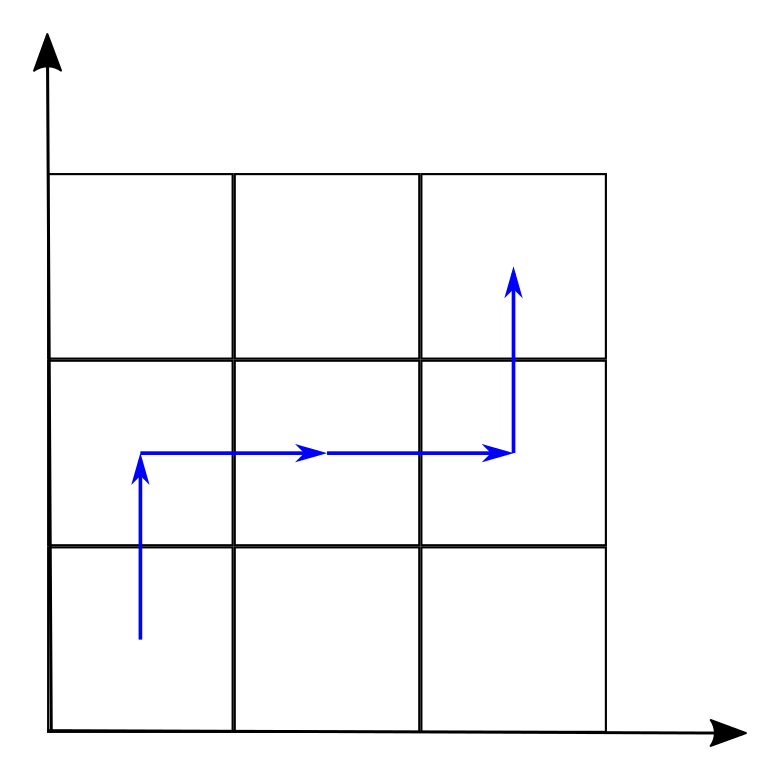
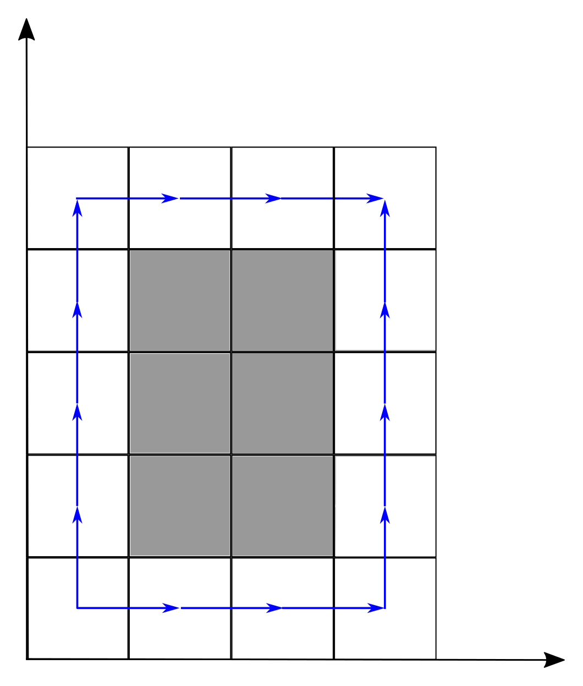
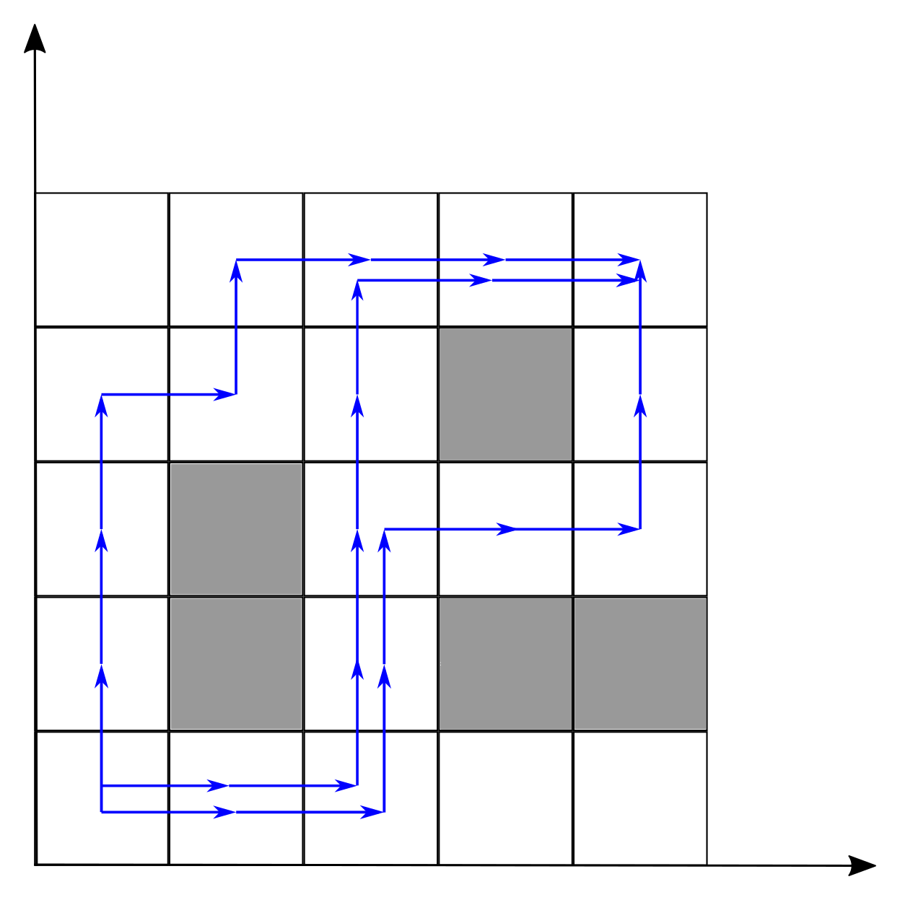

<h1 style='text-align: center;'> D. Slalom</h1>

<h5 style='text-align: center;'>time limit per test: 2 seconds</h5>
<h5 style='text-align: center;'>memory limit per test: 256 megabytes</h5>

Little girl Masha likes winter sports, today she's planning to take part in slalom skiing.

The track is represented as a grid composed of *n* × *m* squares. There are rectangular obstacles at the track, composed of grid squares. Masha must get from the square (1, 1) to the square (*n*, *m*). She can move from a square to adjacent square: either to the right, or upwards. If the square is occupied by an obstacle, it is not allowed to move to that square.

One can see that each obstacle can actually be passed in two ways: either it is to the right of Masha's path, or to the left. Masha likes to try all ways to do things, so she would like to know how many ways are there to pass the track. Two ways are considered different if there is an obstacle such that it is to the right of the path in one way, and to the left of the path in the other way.

Help Masha to find the number of ways to pass the track. The number of ways can be quite big, so Masha would like to know it modulo 109 + 7.

The pictures below show different ways to pass the track in sample tests.   

## Input

The first line of input data contains three positive integers: *n*, *m* and *k* (3 ≤ *n*, *m* ≤ 106, 0 ≤ *k* ≤ 105) — the size of the track and the number of obstacles.

The following *k* lines contain four positive integers each: *x*1, *y*1, *x*2, *y*2 (1 ≤ *x*1 ≤ *x*2 ≤ *n*, 1 ≤ *y*1 ≤ *y*2 ≤ *m*) — coordinates of bottom left, and top right squares of the obstacle. 

It is guaranteed that there are no obstacles at squares (1, 1) and (*n*, *m*), and no obstacles overlap (but some of them may touch).

## Output

## Output

 one integer — the number of ways to pass the track modulo 109 + 7.

## Examples

## Input


```
3 3 0  

```
## Output


```
1  

```
## Input


```
4 5 1  
2 2 3 4  

```
## Output


```
2  

```
## Input


```
5 5 3  
2 2 2 3  
4 2 5 2  
4 4 4 4  

```
## Output


```
3  

```


#### tags 

#3100 #data_structures #dp #sortings 