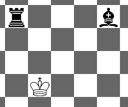
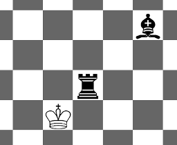

<h1 style='text-align: center;'> D. Anton and Chess</h1>

<h5 style='text-align: center;'>time limit per test: 4 seconds</h5>
<h5 style='text-align: center;'>memory limit per test: 256 megabytes</h5>

Anton likes to play chess. Also, he likes to do programming. That is why he decided to write the program that plays chess. However, he finds the game on 8 to 8 board to too simple, he uses an infinite one instead.

The first task he faced is to check whether the king is in check. Anton doesn't know how to implement this so he asks you to help.

Consider that an infinite chess board contains one white king and the number of black pieces. There are only rooks, bishops and queens, as the other pieces are not supported yet. The white king is said to be in check if at least one black piece can reach the cell with the king in one move. 

Help Anton and write the program that for the given position determines whether the white king is in check.

Remainder, on how do chess pieces move: 

* Bishop moves any number of cells diagonally, but it can't "leap" over the occupied cells.
* Rook moves any number of cells horizontally or vertically, but it also can't "leap" over the occupied cells.
* Queen is able to move any number of cells horizontally, vertically or diagonally, but it also can't "leap".
## Input

The first line of the input contains a single integer *n* (1 ≤ *n* ≤ 500 000) — the number of black pieces.

The second line contains two integers *x*0 and *y*0 ( - 109 ≤ *x*0, *y*0 ≤ 109) — coordinates of the white king.

Then follow *n* lines, each of them contains a character and two integers *x**i* and *y**i* ( - 109 ≤ *x**i*, *y**i* ≤ 109) — type of the *i*-th piece and its position. Character 'B' stands for the bishop, 'R' for the rook and 'Q' for the queen. It's guaranteed that no two pieces occupy the same position.

## Output

The only line of the output should contains "YES" (without quotes) if the white king is in check and "NO" (without quotes) otherwise.

## Examples

## Input


```
2  
4 2  
R 1 1  
B 1 5  

```
## Output


```
YES  

```
## Input


```
2  
4 2  
R 3 3  
B 1 5  

```
## Output


```
NO  

```
## Note

Picture for the first sample: 

   White king is in check, because the black bishop can reach the cell with the white king in one move. The answer is "YES".Picture for the second sample: 

   Here bishop can't reach the cell with the white king, because his path is blocked by the rook, and the bishop cant "leap" over it. Rook can't reach the white king, because it can't move diagonally. Hence, the king is not in check and the answer is "NO".

#### tags 

#1700 #implementation 