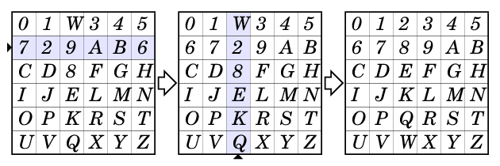

<h1 style='text-align: center;'> E. Shift It!</h1>

<h5 style='text-align: center;'>time limit per test: 2 seconds</h5>
<h5 style='text-align: center;'>memory limit per test: 256 megabytes</h5>

There is a square box 6 × 6 in size. It contains 36 chips 1 × 1 in size. Those chips contain 36 different characters — "0"-"9" and "A"-"Z". There is exactly one chip with each character.

You are allowed to make the following operations: you may choose one of 6 rows or one of 6 columns and cyclically shift the chips there to one position to the left or to the right (for the row) or upwards or downwards (for the column). Those operations are allowed to perform several times. 

To solve the puzzle is to shift the chips using the above described operations so that they were written in the increasing order (exactly equal to the right picture). An example of solving the puzzle is shown on a picture below.

  Write a program that finds the sequence of operations that solves the puzzle. That sequence should not necessarily be shortest, but you should not exceed the limit of 10000 operations. It is guaranteed that the solution always exists.

## Input

The input data are represented by 6 lines containing 6 characters each. They are the puzzle's initial position. Those lines contain each character from the string "0123456789ABCDEFGHIJKLMNOPQRSTUVWXYZ" exactly once.

## Output

On the first line print number *n*, which is the number of operations. On the next *n* lines print the sequence of operations one per line. An operation is described by a word consisting of two characters. The first character shows the direction where the row or the column will be shifted. The possible directions are "L", "R" (to the left, to the right correspondingly, we shift a row), "U", "D" (upwards, downwards correspondingly, we shift a column). The second character is the number of the row (or the column), it is an integer from "1" to "6". The rows are numbered from the top to the bottom, the columns are numbered from the left to the right.

The number of operations should not exceed 104. If there are several solutions, print any of them.

## Examples

## Input


```
01W345  
729AB6  
CD8FGH  
IJELMN  
OPKRST  
UVQXYZ  

```
## Output


```
2  
R2  
U3  

```


#### tags 

#2800 #constructive_algorithms 