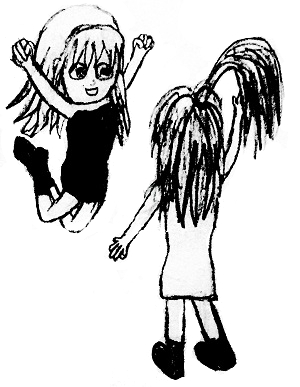

<h1 style='text-align: center;'> B. Arpa's weak amphitheater and Mehrdad's valuable Hoses</h1>

<h5 style='text-align: center;'>time limit per test: 1 second</h5>
<h5 style='text-align: center;'>memory limit per test: 256 megabytes</h5>

Just to remind, girls in Arpa's land are really nice.

Mehrdad wants to invite some Hoses to the palace for a dancing party. Each Hos has some weight *w**i* and some beauty *b**i*. Also each Hos may have some friends. Hoses are divided in some friendship groups. Two Hoses *x* and *y* are in the same friendship group if and only if there is a sequence of Hoses *a*1, *a*2, ..., *a**k* such that *a**i* and *a**i* + 1 are friends for each 1 ≤ *i* < *k*, and *a*1 = *x* and *a**k* = *y*.

  Arpa allowed to use the amphitheater of palace to Mehrdad for this party. Arpa's amphitheater can hold at most *w* weight on it. 

Mehrdad is so greedy that he wants to invite some Hoses such that sum of their weights is not greater than *w* and sum of their beauties is as large as possible. Along with that, from each friendship group he can either invite all Hoses, or no more than one. Otherwise, some Hoses will be hurt. Find for Mehrdad the maximum possible total beauty of Hoses he can invite so that no one gets hurt and the total weight doesn't exceed *w*.

## Input

The first line contains integers *n*, *m* and *w* (1  ≤  *n*  ≤  1000, , 1 ≤ *w* ≤ 1000) — the number of Hoses, the number of pair of friends and the maximum total weight of those who are invited.

The second line contains *n* integers *w*1, *w*2, ..., *w**n* (1 ≤ *w**i* ≤ 1000) — the weights of the Hoses.

The third line contains *n* integers *b*1, *b*2, ..., *b**n* (1 ≤ *b**i* ≤ 106) — the beauties of the Hoses.

The next *m* lines contain pairs of friends, the *i*-th of them contains two integers *x**i* and *y**i* (1 ≤ *x**i*, *y**i* ≤ *n*, *x**i* ≠ *y**i*), meaning that Hoses *x**i* and *y**i* are friends. ## Note

 that friendship is bidirectional. All pairs (*x**i*, *y**i*) are distinct.

## Output

Print the maximum possible total beauty of Hoses Mehrdad can invite so that no one gets hurt and the total weight doesn't exceed *w*.

## Examples

## Input


```
3 1 5  
3 2 5  
2 4 2  
1 2  

```
## Output


```
6  

```
## Input


```
4 2 11  
2 4 6 6  
6 4 2 1  
1 2  
2 3  

```
## Output


```
7  

```
## Note

In the first sample there are two friendship groups: Hoses {1, 2} and Hos {3}. The best way is to choose all of Hoses in the first group, sum of their weights is equal to 5 and sum of their beauty is 6.

In the second sample there are two friendship groups: Hoses {1, 2, 3} and Hos {4}. Mehrdad can't invite all the Hoses from the first group because their total weight is 12 > 11, thus the best way is to choose the first Hos from the first group and the only one from the second group. The total weight will be 8, and the total beauty will be 7.


#### tags 

#1600 #dfs_and_similar #dp #dsu 