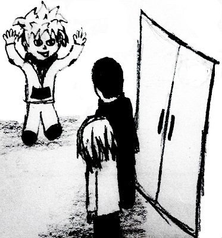

<h1 style='text-align: center;'> C. Arpa’s overnight party and Mehrdad’s silent entering</h1>

<h5 style='text-align: center;'>time limit per test: 1 second</h5>
<h5 style='text-align: center;'>memory limit per test: 256 megabytes</h5>

Note that girls in Arpa’s land are really attractive.

Arpa loves overnight parties. In the middle of one of these parties Mehrdad suddenly appeared. He saw *n* pairs of friends sitting around a table. *i*-th pair consisted of a boy, sitting on the *a**i*-th chair, and his girlfriend, sitting on the *b**i*-th chair. The chairs were numbered 1 through 2*n* in clockwise direction. There was exactly one person sitting on each chair.

  There were two types of food: Kooft and Zahre-mar. Now Mehrdad wonders, was there any way to serve food for the guests such that: 

* Each person had exactly one type of food,
* No boy had the same type of food as his girlfriend,
* Among any three guests sitting on consecutive chairs, there was two of them who had different type of food. Note that chairs 2*n* and 1 are considered consecutive.

Find the answer for the Mehrdad question. If it was possible, find some arrangement of food types that satisfies the conditions.

## Input

The first line contains an integer *n* (1  ≤  *n*  ≤  105) — the number of pairs of guests.

The *i*-th of the next *n* lines contains a pair of integers *a**i* and *b**i* (1  ≤ *a**i*, *b**i* ≤  2*n*) — the number of chair on which the boy in the *i*-th pair was sitting and the number of chair on which his girlfriend was sitting. It's guaranteed that there was exactly one person sitting on each chair. 

## Output

If there is no solution, print -1.

Otherwise print *n* lines, the *i*-th of them should contain two integers which represent the type of food for the *i*-th pair. The first integer in the line is the type of food the boy had, and the second integer is the type of food the girl had. If someone had Kooft, print 1, otherwise print 2.

If there are multiple solutions, print any of them.

## Example

## Input


```
3  
1 4  
2 5  
3 6  

```
## Output


```
1 2  
2 1  
1 2  

```


#### tags 

#2600 #constructive_algorithms #dfs_and_similar #graphs 