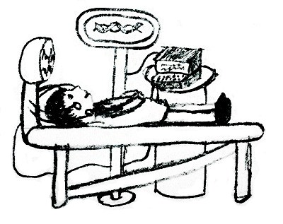

<h1 style='text-align: center;'> E. Arpa’s abnormal DNA and Mehrdad’s deep interest</h1>

<h5 style='text-align: center;'>time limit per test: 2 seconds</h5>
<h5 style='text-align: center;'>memory limit per test: 256 megabytes</h5>

All of us know that girls in Arpa’s land are... ok, you’ve got the idea :D

Anyone knows that Arpa isn't a normal man, he is ... well, sorry, I can't explain it more. Mehrdad is interested about the reason, so he asked Sipa, one of the best biology scientists in Arpa's land, for help. Sipa has a DNA editor.

  Sipa put Arpa under the DNA editor. DNA editor showed Arpa's DNA as a string *S* consisting of *n* lowercase English letters. Also Sipa has another DNA *T* consisting of lowercase English letters that belongs to a normal man.

Now there are (*n* + 1) options to change Arpa's DNA, numbered from 0 to *n*. *i*-th of them is to put *T* between *i*-th and (*i* + 1)-th characters of *S* (0 ≤ *i* ≤ *n*). If *i* = 0, *T* will be put before *S*, and if *i* = *n*, it will be put after *S*.

Mehrdad wants to choose the most interesting option for Arpa's DNA among these *n* + 1 options. DNA *A* is more interesting than *B* if *A* is lexicographically smaller than *B*. Mehrdad asked Sipa *q* questions: 

Given integers *l*, *r*, *k*, *x*, *y*, what is the most interesting option if we only consider such options *i* that *l* ≤ *i* ≤ *r* and ? If there are several most interesting options, Mehrdad wants to know one with the smallest number *i*.

Since Sipa is a biology scientist but not a programmer, you should help him.

## Input

The first line contains strings *S*, *T* and integer *q* (1 ≤ |*S*|, |*T*|, *q* ≤ 105) — Arpa's DNA, the DNA of a normal man, and the number of Mehrdad's questions. The strings *S* and *T* consist only of small English letters.

Next *q* lines describe the Mehrdad's questions. Each of these lines contain five integers *l*, *r*, *k*, *x*, *y* (0 ≤ *l* ≤ *r* ≤ *n*, 1 ≤ *k* ≤ *n*, 0 ≤ *x* ≤ *y* < *k*).

## Output

Print *q* integers. The *j*-th of them should be the number *i* of the most interesting option among those that satisfy the conditions of the *j*-th question. If there is no option *i* satisfying the conditions in some question, print -1.

## Examples

## Input


```
abc d 4  
0 3 2 0 0  
0 3 1 0 0  
1 2 1 0 0  
0 1 3 2 2  

```
## Output


```
2 3 2 -1   

```
## Input


```
abbbbbbaaa baababaaab 10  
1 2 1 0 0  
2 7 8 4 7  
2 3 9 2 8  
3 4 6 1 1  
0 8 5 2 4  
2 8 10 4 7  
7 10 1 0 0  
1 4 6 0 2  
0 9 8 0 6  
4 8 5 0 1  

```
## Output


```
1 4 2 -1 2 4 10 1 1 5   

```
## Note

Explanation of first sample case:

In the first question Sipa has two options: dabc (*i* = 0) and abdc (*i* = 2). The latter (abcd) is better than abdc, so answer is 2.

In the last question there is no *i* such that 0 ≤ *i* ≤ 1 and .


#### tags 

#3400 #data_structures #string_suffix_structures 