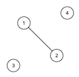
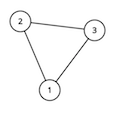

<h1 style='text-align: center;'> A. Hongcow Builds A Nation</h1>

<h5 style='text-align: center;'>time limit per test: 2 seconds</h5>
<h5 style='text-align: center;'>memory limit per test: 256 megabytes</h5>

Hongcow is ruler of the world. As ruler of the world, he wants to make it easier for people to travel by road within their own countries.

The world can be modeled as an undirected graph with *n* nodes and *m* edges. *k* of the nodes are home to the governments of the *k* countries that make up the world.

There is at most one edge connecting any two nodes and no edge connects a node to itself. Furthermore, for any two nodes corresponding to governments, there is no path between those two nodes. Any graph that satisfies all of these conditions is stable.

Hongcow wants to add as many edges as possible to the graph while keeping it stable. Determine the maximum number of edges Hongcow can add.

## Input

The first line of input will contain three integers *n*, *m* and *k* (1 ≤ *n* ≤ 1 000, 0 ≤ *m* ≤ 100 000, 1 ≤ *k* ≤ *n*) — the number of vertices and edges in the graph, and the number of vertices that are homes of the government. 

The next line of input will contain *k* integers *c*1, *c*2, ..., *c**k* (1 ≤ *c**i* ≤ *n*). These integers will be pairwise distinct and denote the nodes that are home to the governments in this world.

The following *m* lines of input will contain two integers *u**i* and *v**i* (1 ≤ *u**i*, *v**i* ≤ *n*). This denotes an undirected edge between nodes *u**i* and *v**i*.

It is guaranteed that the graph described by the input is stable.

## Output

## Output

 a single integer, the maximum number of edges Hongcow can add to the graph while keeping it stable.

## Examples

## Input


```
4 1 2  
1 3  
1 2  

```
## Output


```
2  

```
## Input


```
3 3 1  
2  
1 2  
1 3  
2 3  

```
## Output


```
0  

```
## Note

For the first sample test, the graph looks like this: 

   Vertices 1 and 3 are special. The optimal solution is to connect vertex 4 to vertices 1 and 2. This adds a total of 2 edges. We cannot add any more edges, since vertices 1 and 3 cannot have any path between them.For the second sample test, the graph looks like this: 

   We cannot add any more edges to this graph. ## Note

 that we are not allowed to add self-loops, and the graph must be simple.

#### tags 

#1500 #dfs_and_similar #graphs 