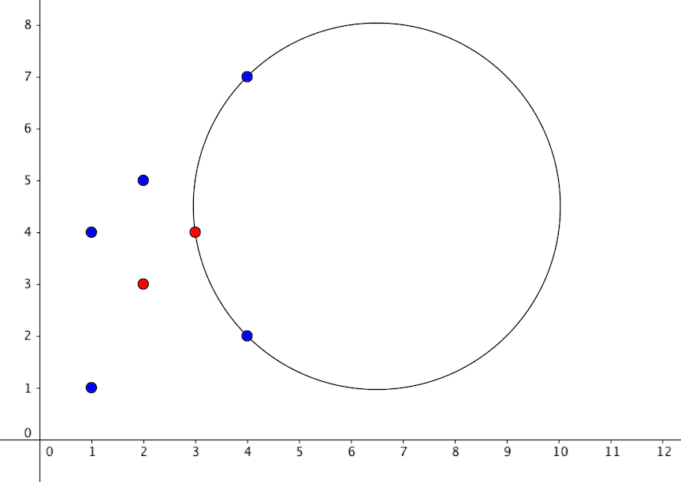
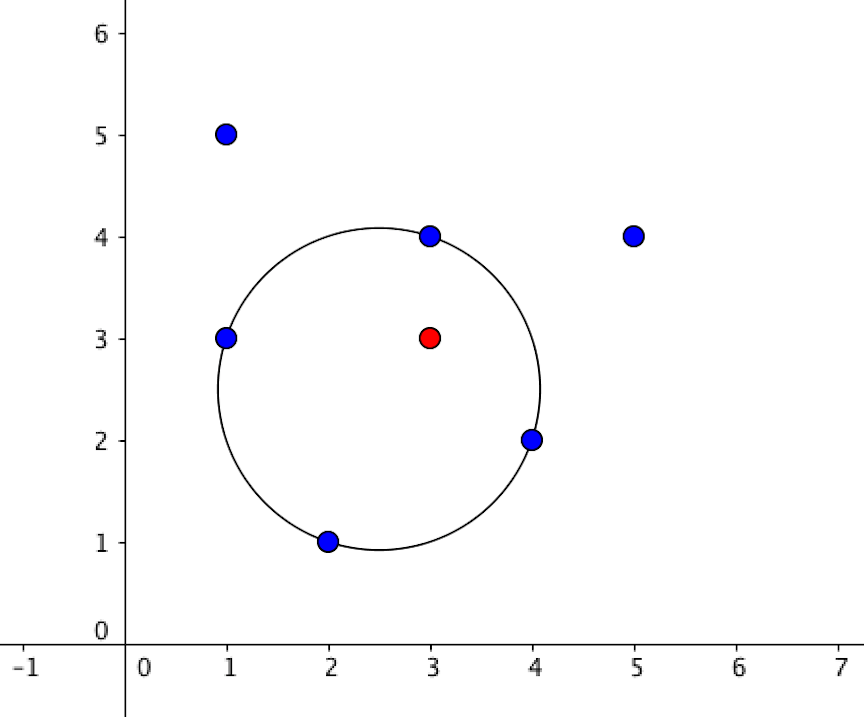

<h1 style='text-align: center;'> D. Hongcow Draws a Circle</h1>

<h5 style='text-align: center;'>time limit per test: 6 seconds</h5>
<h5 style='text-align: center;'>memory limit per test: 256 megabytes</h5>

Hongcow really likes the color red. Hongcow doesn't like the color blue.

Hongcow is standing in an infinite field where there are *n* red points and *m* blue points.

Hongcow wants to draw a circle in the field such that this circle contains at least one red point, and no blue points. Points that line exactly on the boundary of the circle can be counted as either inside or outside.

Compute the radius of the largest circle that satisfies this condition. If this circle can have arbitrarily large size, print  - 1. Otherwise, your answer will be accepted if it has relative or absolute error at most 10- 4.

## Input

The first line of the input will contain two integers *n*, *m* (1 ≤ *n*, *m* ≤ 1, 000).

The next *n* lines will contain two integers *x**i*, *y**i* (1 ≤ *x**i*, *y**i* ≤ 104). This denotes the coordinates of a red point.

The next *m* lines will contain two integers *x**i*, *y**i* (1 ≤ *x**i*, *y**i* ≤ 104). This denotes the coordinates of a blue point.

No two points will have the same coordinates.

## Output

Print  - 1 if the circle can have arbitrary size. Otherwise, print a floating point number representing the largest radius circle that satisfies the conditions. Your answer will be considered correct if its absolute or relative error does not exceed 10- 4.

Namely, let's assume that your answer is *a* and the answer of the jury is *b*. The checker program will consider your answer correct if .

## Examples

## Input


```
2 5  
2 3  
3 4  
1 1  
1 4  
4 2  
4 7  
2 5  

```
## Output


```
3.5355338827  

```
## Input


```
1 6  
3 3  
1 5  
5 4  
2 1  
3 4  
4 2  
1 3  

```
## Output


```
1.5811388195  

```
## Input


```
2 2  
2 2  
3 3  
1 1  
4 4  

```
## Output


```
-1  

```
## Note

This is a picture of the first sample 

  This is a picture of the second sample 

  

#### tags 

#3200 #geometry 