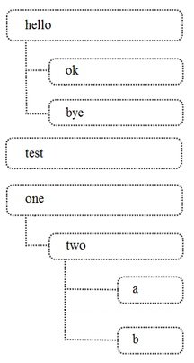

<h1 style='text-align: center;'> E. Comments</h1>

<h5 style='text-align: center;'>time limit per test: 2 seconds</h5>
<h5 style='text-align: center;'>memory limit per test: 256 megabytes</h5>

A rare article in the Internet is posted without a possibility to comment it. On a Polycarp's website each article has comments feed.

Each comment on Polycarp's website is a non-empty string consisting of uppercase and lowercase letters of English alphabet. Comments have tree-like structure, that means each comment except root comments (comments of the highest level) has exactly one parent comment.

When Polycarp wants to save comments to his hard drive he uses the following format. Each comment he writes in the following format: 

* at first, the text of the comment is written;
* after that the number of comments is written, for which this comment is a parent comment (i. e. the number of the replies to this comments);
* after that the comments for which this comment is a parent comment are written (the writing of these comments uses the same algorithm).

 All elements in this format are separated by single comma. Similarly, the comments of the first level are separated by comma.For example, if the comments look like:

  then the first comment is written as "hello,2,ok,0,bye,0", the second is written as "test,0", the third comment is written as "one,1,two,2,a,0,b,0". The whole comments feed is written as: "hello,2,ok,0,bye,0,test,0,one,1,two,2,a,0,b,0". For a given comments feed in the format specified above print the comments in a different format: 

* at first, print a integer *d* — the maximum depth of nesting comments;
* after that print *d* lines, the *i*-th of them corresponds to nesting level *i*;
* for the *i*-th row print comments of nesting level *i* in the order of their appearance in the Policarp's comments feed, separated by space.
## Input

The first line contains non-empty comments feed in the described format. It consists of uppercase and lowercase letters of English alphabet, digits and commas. 

It is guaranteed that each comment is a non-empty string consisting of uppercase and lowercase English characters. Each of the number of comments is integer (consisting of at least one digit), and either equals 0 or does not contain leading zeros.

The length of the whole string does not exceed 106. It is guaranteed that given structure of comments is valid. 

## Output

Print comments in a format that is given in the statement. For each level of nesting, comments should be printed in the order they are given in the input.

## Examples

## Input


```
hello,2,ok,0,bye,0,test,0,one,1,two,2,a,0,b,0  

```
## Output


```
3  
hello test one   
ok bye two   
a b   

```
  
  
## Input


```
a,5,A,0,a,0,A,0,a,0,A,0  

```
## Output


```
2  
a   
A a A a A   

```
  
  
## Input


```
A,3,B,2,C,0,D,1,E,0,F,1,G,0,H,1,I,1,J,0,K,1,L,0,M,2,N,0,O,1,P,0  

```
## Output


```
4  
A K M   
B F H L N O   
C D G I P   
E J   

```
  
## Note

The first example is explained in the statements. 


#### tags 

#1700 #dfs_and_similar #expression_parsing #implementation #strings 