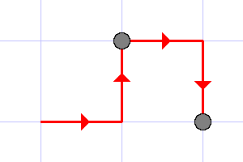
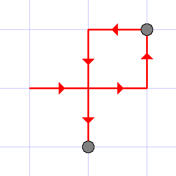
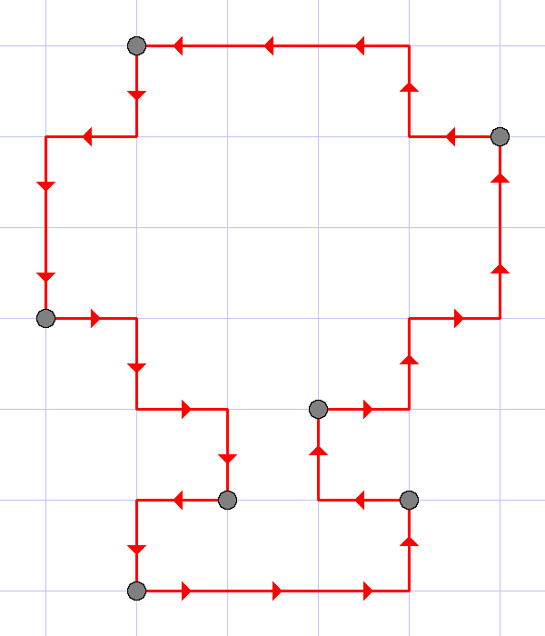

<h1 style='text-align: center;'> C. Santa Claus and Robot</h1>

<h5 style='text-align: center;'>time limit per test: 2 seconds</h5>
<h5 style='text-align: center;'>memory limit per test: 256 megabytes</h5>

Santa Claus has Robot which lives on the infinite grid and can move along its lines. He can also, having a sequence of *m* points *p*1, *p*2, ..., *p**m* with integer coordinates, do the following: denote its initial location by *p*0. First, the robot will move from *p*0 to *p*1 along one of the shortest paths between them (please notice that since the robot moves only along the grid lines, there can be several shortest paths). Then, after it reaches *p*1, it'll move to *p*2, again, choosing one of the shortest ways, then to *p*3, and so on, until he has visited all points in the given order. Some of the points in the sequence may coincide, in that case Robot will visit that point several times according to the sequence order.

While Santa was away, someone gave a sequence of points to Robot. This sequence is now lost, but Robot saved the protocol of its unit movements. Please, find the minimum possible length of the sequence.

## Input

The first line of input contains the only positive integer *n* (1 ≤ *n* ≤ 2·105) which equals the number of unit segments the robot traveled. The second line contains the movements protocol, which consists of *n* letters, each being equal either L, or R, or U, or D. *k*-th letter stands for the direction which Robot traveled the *k*-th unit segment in: L means that it moved to the left, R — to the right, U — to the top and D — to the bottom. Have a look at the illustrations for better explanation.

## Output

The only line of input should contain the minimum possible length of the sequence.

## Examples

## Input


```
4  
RURD  

```
## Output


```
2  

```
## Input


```
6  
RRULDD  

```
## Output


```
2  

```
## Input


```
26  
RRRULURURUULULLLDLDDRDRDLD  

```
## Output


```
7  

```
## Input


```
3  
RLL  

```
## Output


```
2  

```
## Input


```
4  
LRLR  

```
## Output


```
4  

```
## Note

The illustrations to the first three tests are given below.

  

The last example illustrates that each point in the sequence should be counted as many times as it is presented in the sequence.


#### tags 

#1400 #constructive_algorithms #math 