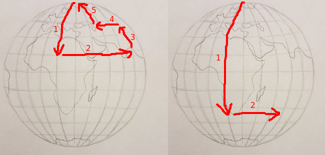

<h1 style='text-align: center;'> B. New Year and North Pole</h1>

<h5 style='text-align: center;'>time limit per test: 2 seconds</h5>
<h5 style='text-align: center;'>memory limit per test: 256 megabytes</h5>

In this problem we assume the Earth to be a completely round ball and its surface a perfect sphere. The length of the equator and any meridian is considered to be exactly 40 000 kilometers. Thus, travelling from North Pole to South Pole or vice versa takes exactly 20 000 kilometers.

Limak, a polar bear, lives on the North Pole. Close to the New Year, he helps somebody with delivering packages all around the world. Instead of coordinates of places to visit, Limak got a description how he should move, assuming that he starts from the North Pole. The description consists of *n* parts. In the *i*-th part of his journey, Limak should move *t**i* kilometers in the direction represented by a string *dir**i* that is one of: "North", "South", "West", "East".

Limak isn’t sure whether the description is valid. You must help him to check the following conditions:

* If at any moment of time (before any of the instructions or while performing one of them) Limak is on the North Pole, he can move only to the South.
* If at any moment of time (before any of the instructions or while performing one of them) Limak is on the South Pole, he can move only to the North.
* The journey must end on the North Pole.

Check if the above conditions are satisfied and print "YES" or "NO" on a single line.

## Input

The first line of the input contains a single integer *n* (1 ≤ *n* ≤ 50).

The *i*-th of next *n* lines contains an integer *t**i* and a string *dir**i* (1 ≤ *t**i* ≤ 106, ) — the length and the direction of the *i*-th part of the journey, according to the description Limak got.

## Output

Print "YES" if the description satisfies the three conditions, otherwise print "NO", both without the quotes.

## Examples

## Input


```
5  
7500 South  
10000 East  
3500 North  
4444 West  
4000 North  

```
## Output


```
YES  

```
## Input


```
2  
15000 South  
4000 East  

```
## Output


```
NO  

```
## Input


```
5  
20000 South  
1000 North  
1000000 West  
9000 North  
10000 North  

```
## Output


```
YES  

```
## Input


```
3  
20000 South  
10 East  
20000 North  

```
## Output


```
NO  

```
## Input


```
2  
1000 North  
1000 South  

```
## Output


```
NO  

```
## Input


```
4  
50 South  
50 North  
15000 South  
15000 North  

```
## Output


```
YES  

```
## Note

Drawings below show how Limak's journey would look like in first two samples. In the second sample the answer is "NO" because he doesn't end on the North Pole.

  

#### tags 

#1300 #geometry #implementation 