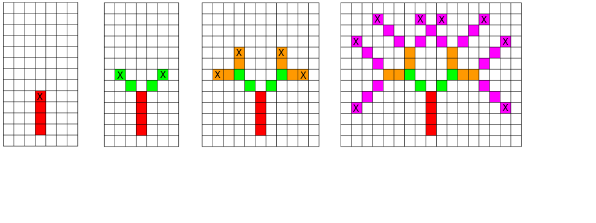
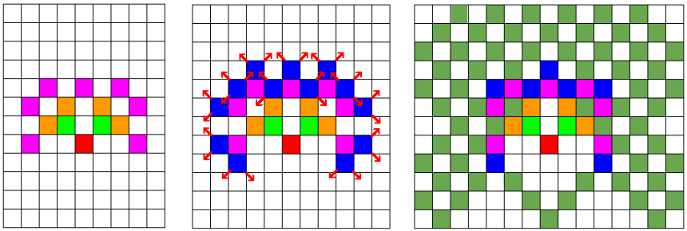

<h1 style='text-align: center;'> D. New Year and Fireworks</h1>

<h5 style='text-align: center;'>time limit per test: 2.5 seconds</h5>
<h5 style='text-align: center;'>memory limit per test: 256 megabytes</h5>

One tradition of welcoming the New Year is launching fireworks into the sky. Usually a launched firework flies vertically upward for some period of time, then explodes, splitting into several parts flying in different directions. Sometimes those parts also explode after some period of time, splitting into even more parts, and so on.

Limak, who lives in an infinite grid, has a single firework. The behaviour of the firework is described with a recursion depth *n* and a duration for each level of recursion *t*1, *t*2, ..., *t**n*. Once Limak launches the firework in some cell, the firework starts moving upward. After covering *t*1 cells (including the starting cell), it explodes and splits into two parts, each moving in the direction changed by 45 degrees (see the pictures below for clarification). So, one part moves in the top-left direction, while the other one moves in the top-right direction. Each part explodes again after covering *t*2 cells, splitting into two parts moving in directions again changed by 45 degrees. The process continues till the *n*-th level of recursion, when all 2*n* - 1 existing parts explode and disappear without creating new parts. After a few levels of recursion, it's possible that some parts will be at the same place and at the same time — it is allowed and such parts do not crash.

Before launching the firework, Limak must make sure that nobody stands in cells which will be visited at least once by the firework. Can you count the number of those cells?

## Input

The first line of the input contains a single integer *n* (1 ≤ *n* ≤ 30) — the total depth of the recursion.

The second line contains *n* integers *t*1, *t*2, ..., *t**n* (1 ≤ *t**i* ≤ 5). On the *i*-th level each of 2*i* - 1 parts will cover *t**i* cells before exploding.

## Output

Print one integer, denoting the number of cells which will be visited at least once by any part of the firework.

## Examples

## Input


```
4  
4 2 2 3  

```
## Output


```
39  

```
## Input


```
6  
1 1 1 1 1 3  

```
## Output


```
85  

```
## Input


```
1  
3  

```
## Output


```
3  

```
## Note

For the first sample, the drawings below show the situation after each level of recursion. Limak launched the firework from the bottom-most red cell. It covered *t*1 = 4 cells (marked red), exploded and divided into two parts (their further movement is marked green). All explosions are marked with an 'X' character. On the last drawing, there are 4 red, 4 green, 8 orange and 23 pink cells. So, the total number of visited cells is 4 + 4 + 8 + 23 = 39.

  For the second sample, the drawings below show the situation after levels 4, 5 and 6. The middle drawing shows directions of all parts that will move in the next level.

  

#### tags 

#1900 #brute_force #data_structures #dfs_and_similar #dp #implementation 