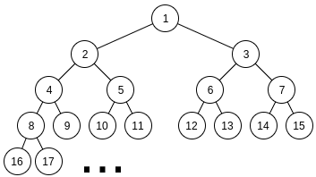
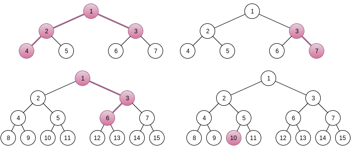

<h1 style='text-align: center;'> G. New Year and Binary Tree Paths</h1>

<h5 style='text-align: center;'>time limit per test: 3 seconds</h5>
<h5 style='text-align: center;'>memory limit per test: 256 megabytes</h5>

The New Year tree is an infinite perfect binary tree rooted in the node 1. Each node *v* has two children: nodes indexed (2·*v*) and (2·*v* + 1).

  Polar bears love decorating the New Year tree and Limak is no exception. As he is only a little bear, he was told to decorate only one simple path between some pair of nodes. Though he was given an opportunity to pick the pair himself! Now he wants to know the number of unordered pairs of indices (*u*, *v*) (*u* ≤ *v*), such that the sum of indices of all nodes along the simple path between *u* and *v* (including endpoints) is equal to *s*. Can you help him and count this value?

## Input

The only line of the input contains a single integer *s* (1 ≤ *s* ≤ 1015).

## Output

Print one integer, denoting the number of unordered pairs of nodes indices defining simple paths with the sum of indices of vertices equal to *s*.

## Example

## Input


```
10  

```
## Output


```
4  

```
## Note

In sample test, there are 4 paths with the sum of indices equal to 10:

  

#### tags 

#3200 #bitmasks #brute_force #combinatorics #dp 