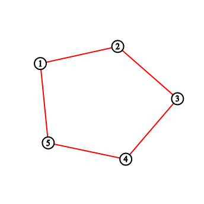
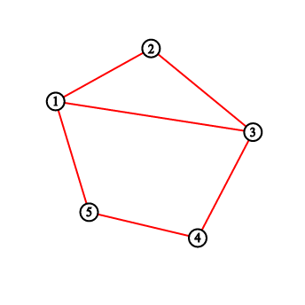
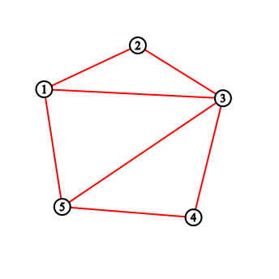
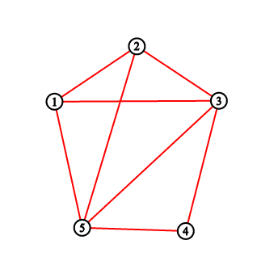
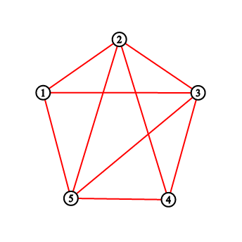
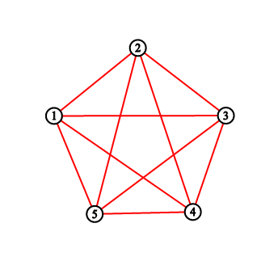

<h1 style='text-align: center;'> D. PolandBall and Polygon</h1>

<h5 style='text-align: center;'>time limit per test: 4 seconds</h5>
<h5 style='text-align: center;'>memory limit per test: 256 megabytes</h5>

PolandBall has such a convex polygon with *n* veritces that no three of its diagonals intersect at the same point. PolandBall decided to improve it and draw some red segments. 

He chose a number *k* such that *gcd*(*n*, *k*) = 1. Vertices of the polygon are numbered from 1 to *n* in a clockwise way. PolandBall repeats the following process *n* times, starting from the vertex 1: 

Assume you've ended last operation in vertex *x* (consider *x* = 1 if it is the first operation). Draw a new segment from vertex *x* to *k*-th next vertex in clockwise direction. This is a vertex *x* + *k* or *x* + *k* - *n* depending on which of these is a valid index of polygon's vertex.

Your task is to calculate number of polygon's sections after each drawing. A section is a clear area inside the polygon bounded with drawn diagonals or the polygon's sides.

## Input

There are only two numbers in the input: *n* and *k* (5 ≤ *n* ≤ 106, 2 ≤ *k* ≤ *n* - 2, *gcd*(*n*, *k*) = 1).

## Output

You should print *n* values separated by spaces. The *i*-th value should represent number of polygon's sections after drawing first *i* lines.

## Examples

## Input


```
5 2  

```
## Output


```
2 3 5 8 11 
```
## Input


```
10 3  

```
## Output


```
2 3 4 6 9 12 16 21 26 31 
```
## Note

The greatest common divisor (gcd) of two integers *a* and *b* is the largest positive integer that divides both *a* and *b* without a remainder.

For the first sample testcase, you should output "2 3 5 8 11". Pictures below correspond to situations after drawing lines.

       

#### tags 

#2000 #data_structures 