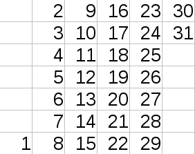

<h1 style='text-align: center;'> A. Petr and a calendar</h1>

<h5 style='text-align: center;'>time limit per test: 2 seconds</h5>
<h5 style='text-align: center;'>memory limit per test: 256 megabytes</h5>

Petr wants to make a calendar for current month. For this purpose he draws a table in which columns correspond to weeks (a week is seven consequent days from Monday to Sunday), rows correspond to weekdays, and cells contain dates. For example, a calendar for January 2017 should look like on the picture:

  Petr wants to know how many columns his table should have given the month and the weekday of the first date of that month? Assume that the year is non-leap.

## Input

The only line contain two integers *m* and *d* (1 ≤ *m* ≤ 12, 1 ≤ *d* ≤ 7) — the number of month (January is the first month, December is the twelfth) and the weekday of the first date of this month (1 is Monday, 7 is Sunday).

## Output

Print single integer: the number of columns the table should have.

## Examples

## Input


```
1 7  

```
## Output


```
6  

```
## Input


```
1 1  

```
## Output


```
5  

```
## Input


```
11 6  

```
## Output


```
5  

```
## Note

The first example corresponds to the January 2017 shown on the picture in the statements.

In the second example 1-st January is Monday, so the whole month fits into 5 columns.

In the third example 1-st November is Saturday and 5 columns is enough.


#### tags 

#800 #implementation #math 