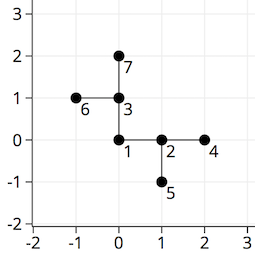

<h1 style='text-align: center;'> E. Dasha and Puzzle</h1>

<h5 style='text-align: center;'>time limit per test: 2 seconds</h5>
<h5 style='text-align: center;'>memory limit per test: 256 megabytes</h5>

Dasha decided to have a rest after solving the problem. She had been ready to start her favourite activity — origami, but remembered the puzzle that she could not solve. 

  The tree is a non-oriented connected graph without cycles. In particular, there always are *n* - 1 edges in a tree with *n* vertices.

The puzzle is to position the vertices at the points of the Cartesian plane with integral coordinates, so that the segments between the vertices connected by edges are parallel to the coordinate axes. Also, the intersection of segments is allowed only at their ends. Distinct vertices should be placed at different points. 

Help Dasha to find any suitable way to position the tree vertices on the plane.

It is guaranteed that if it is possible to position the tree vertices on the plane without violating the condition which is given above, then you can do it by using points with integral coordinates which don't exceed 1018 in absolute value.

## Input

The first line contains single integer *n* (1 ≤ *n* ≤ 30) — the number of vertices in the tree. 

Each of next *n* - 1 lines contains two integers *u**i*, *v**i* (1 ≤ *u**i*, *v**i* ≤ *n*) that mean that the *i*-th edge of the tree connects vertices *u**i* and *v**i*.

It is guaranteed that the described graph is a tree.

## Output

If the puzzle doesn't have a solution then in the only line print "NO".

Otherwise, the first line should contain "YES". The next *n* lines should contain the pair of integers *x**i*, *y**i* (|*x**i*|, |*y**i*| ≤ 1018) — the coordinates of the point which corresponds to the *i*-th vertex of the tree.

If there are several solutions, print any of them. 

## Examples

## Input


```
7  
1 2  
1 3  
2 4  
2 5  
3 6  
3 7
```
## Output


```
YES  
0 0  
1 0  
0 1  
2 0  
1 -1  
-1 1  
0 2
```
## Input


```
6  
1 2  
2 3  
2 4  
2 5  
2 6  

```
## Output


```
NO  

```
## Input


```
4  
1 2  
2 3  
3 4
```
## Output


```
YES  
3 3  
4 3  
5 3  
6 3
```
## Note

In the first sample one of the possible positions of tree is: 


#### tags 

#2000 #constructive_algorithms #dfs_and_similar #graphs #greedy #trees 