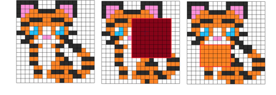

<h1 style='text-align: center;'> F. Dasha and Photos</h1>

<h5 style='text-align: center;'>time limit per test: 4 seconds</h5>
<h5 style='text-align: center;'>memory limit per test: 512 megabytes</h5>

Dasha decided to have a rest after solving the problem *D* and began to look photos from previous competitions.

Let's call photos as the matrix with the size *n* × *m*, which consists of lowercase English letters.

Some *k* photos especially interested her, because they can be received from photo-template by painting a rectangular area in a certain color. Let's call such photos special. 

  More formally the *i*-th special photo is received from the photo-template by replacing all characters on some rectangle with upper left corner of the cell with coordinates (*a**i*, *b**i*) and lower right corner in the cell with coordinates (*c**i*, *d**i*) to the symbol *e**i*.

Dasha asks you to find the special photo so that the total distance from it to all other special photos is minimum. And calculate this distance.

Determine the distance between two photos as the sum of distances between all corresponding letters. The distance between two letters is the difference module of their positions in the alphabet. For example, the distance between letters 'h' and 'm' equals |8 - 13| = 5, because the letter 'h' is the 8-th in the alphabet, the letter 'm' is the 13-th.

## Input

The first line contains three integers *n*, *m*, *k* (1 ≤ *n*, *m* ≤ 103, 1 ≤ *k* ≤ 3·105) — the number of strings in the photo-template, the number of columns and the number of special photos which are interesting for Dasha. 

The next *n* lines contains the string with *m* length which consists of little Latin characters — the description of the photo-template.

Each of the next *k* lines contains the description of the special photo in the following format, "*a**i* *b**i* *c**i* *d**i* *e**i*" (1 ≤ *a**i* ≤ *c**i* ≤ *n*, 1 ≤ *b**i* ≤ *d**i* ≤ *m*), where (*a**i*, *b**i*) — is the coordinate of the upper left corner of the rectangle, (*c**i*, *d**i*) — is the description of the lower right corner, and *e**i* — is the little Latin letter which replaces the photo-template in the described rectangle. 

## Output

In the only line print the minimum total distance from the found special photo to all other special photos.

## Examples

## Input


```
3 3 2  
aaa  
aaa  
aaa  
1 1 2 2 b  
2 2 3 3 c  

```
## Output


```
10  

```
## Input


```
5 5 3  
abcde  
eabcd  
deabc  
cdeab  
bcdea  
1 1 3 4 f  
1 2 3 3 e  
1 3 3 4 i  

```
## Output


```
59  

```
## Note

In the first example the photos are following: 


```
  
bba    aaa  
bba    acc  
aaa    acc  

```
The distance between them is 10.


#### tags 

#2600 #brute_force #data_structures #dp #implementation 