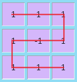
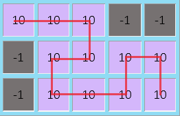

<h1 style='text-align: center;'> D. Maximum path</h1>

<h5 style='text-align: center;'>time limit per test: 1 second</h5>
<h5 style='text-align: center;'>memory limit per test: 256 megabytes</h5>

You are given a rectangular table 3 × *n*. Each cell contains an integer. You can move from one cell to another if they share a side.

Find such path from the upper left cell to the bottom right cell of the table that doesn't visit any of the cells twice, and the sum of numbers written in the cells of this path is maximum possible.

## Input

The first line contains an integer *n* (1 ≤ *n* ≤ 105)  — the number of columns in the table.

Next three lines contain *n* integers each  — the description of the table. The *j*-th number in the *i*-th line corresponds to the cell *a**ij* ( - 109 ≤ *a**ij* ≤ 109) of the table.

## Output

## Output

 the maximum sum of numbers on a path from the upper left cell to the bottom right cell of the table, that doesn't visit any of the cells twice.

## Examples

## Input


```
3  
1 1 1  
1 -1 1  
1 1 1  

```
## Output


```
7  

```
## Input


```
5  
10 10 10 -1 -1  
-1 10 10 10 10  
-1 10 10 10 10  

```
## Output


```
110  

```
## Note

The path for the first example:

  The path for the second example:

  

#### tags 

#2300 #dp #greedy #implementation 