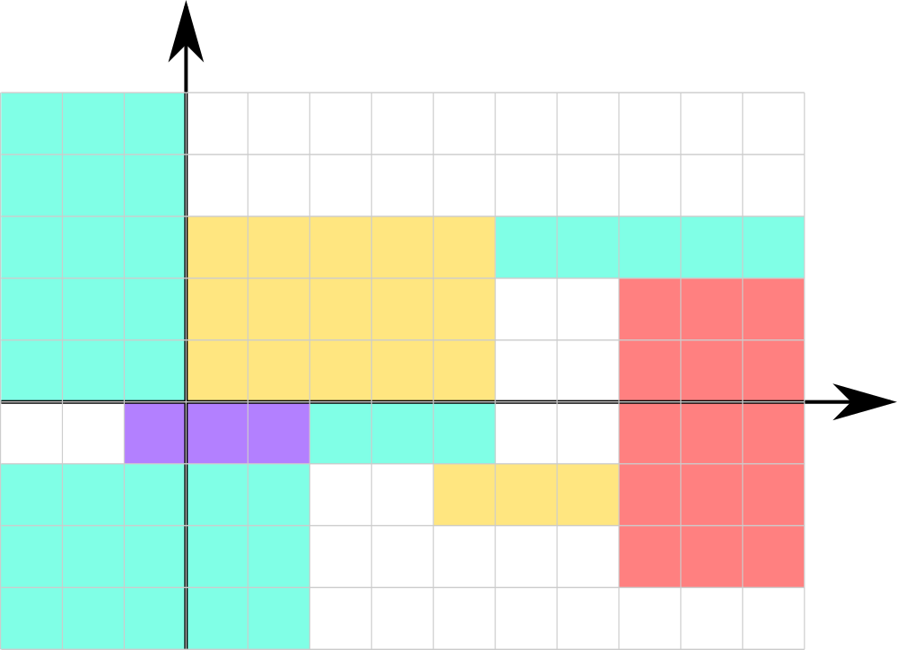

<h1 style='text-align: center;'> B. Timofey and rectangles</h1>

<h5 style='text-align: center;'>time limit per test: 2 seconds</h5>
<h5 style='text-align: center;'>memory limit per test: 256 megabytes</h5>

One of Timofey's birthday presents is a colourbook in a shape of an infinite plane. On the plane *n* rectangles with sides parallel to coordinate axes are situated. All sides of the rectangles have odd length. Rectangles cannot intersect, but they can touch each other.

Help Timofey to color his rectangles in 4 different colors in such a way that every two rectangles touching each other by side would have different color, or determine that it is impossible.

Two rectangles intersect if their intersection has positive area. Two rectangles touch by sides if there is a pair of sides such that their intersection has non-zero length

  The picture corresponds to the first example ## Input

The first line contains single integer *n* (1 ≤ *n* ≤ 5·105) — the number of rectangles.

*n* lines follow. The *i*-th of these lines contains four integers *x*1, *y*1, *x*2 and *y*2 ( - 109 ≤ *x*1 < *x*2 ≤ 109,  - 109 ≤ *y*1 < *y*2 ≤ 109), that means that points (*x*1, *y*1) and (*x*2, *y*2) are the coordinates of two opposite corners of the *i*-th rectangle.

It is guaranteed, that all sides of the rectangles have odd lengths and rectangles don't intersect each other.

## Output

Print "NO" in the only line if it is impossible to color the rectangles in 4 different colors in such a way that every two rectangles touching each other by side would have different color.

Otherwise, print "YES" in the first line. Then print *n* lines, in the *i*-th of them print single integer *c**i* (1 ≤ *c**i* ≤ 4) — the color of *i*-th rectangle.

## Example

## Input


```
8  
0 0 5 3  
2 -1 5 0  
-3 -4 2 -1  
-1 -1 2 0  
-3 0 0 5  
5 2 10 3  
7 -3 10 2  
4 -2 7 -1  

```
## Output


```
YES  
1  
2  
2  
3  
2  
2  
4  
1  

```


#### tags 

#2100 #constructive_algorithms #geometry 