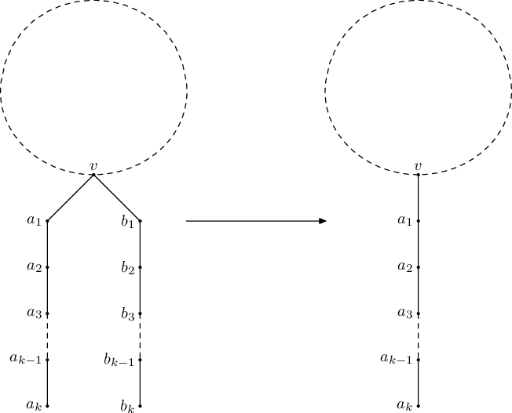

<h1 style='text-align: center;'> E. Tree Folding</h1>

<h5 style='text-align: center;'>time limit per test: 2 seconds</h5>
<h5 style='text-align: center;'>memory limit per test: 512 megabytes</h5>

Vanya wants to minimize a tree. He can perform the following operation multiple times: choose a vertex *v*, and two disjoint (except for *v*) paths of equal length *a*0 = *v*, *a*1, ..., *a**k*, and *b*0 = *v*, *b*1, ..., *b**k*. Additionally, vertices *a*1, ..., *a**k*, *b*1, ..., *b**k* must not have any neighbours in the tree other than adjacent vertices of corresponding paths. After that, one of the paths may be merged into the other, that is, the vertices *b*1, ..., *b**k* can be effectively erased:

  Help Vanya determine if it possible to make the tree into a path via a sequence of described operations, and if the answer is positive, also determine the shortest length of such path.

## Input

The first line of input contains the number of vertices *n* (2 ≤ *n* ≤ 2·105).

Next *n* - 1 lines describe edges of the tree. Each of these lines contains two space-separated integers *u* and *v* (1 ≤ *u*, *v* ≤ *n*, *u* ≠ *v*) — indices of endpoints of the corresponding edge. It is guaranteed that the given graph is a tree.

## Output

If it is impossible to obtain a path, print -1. Otherwise, print the minimum number of edges in a possible path.

## Examples

## Input


```
6  
1 2  
2 3  
2 4  
4 5  
1 6  

```
## Output


```
3  

```
## Input


```
7  
1 2  
1 3  
3 4  
1 5  
5 6  
6 7  

```
## Output


```
-1  

```
## Note

In the first sample case, a path of three edges is obtained after merging paths 2 - 1 - 6 and 2 - 4 - 5.

It is impossible to perform any operation in the second sample case. For example, it is impossible to merge paths 1 - 3 - 4 and 1 - 5 - 6, since vertex 6 additionally has a neighbour 7 that is not present in the corresponding path.


#### tags 

#2200 #dfs_and_similar #dp #greedy #implementation #trees 