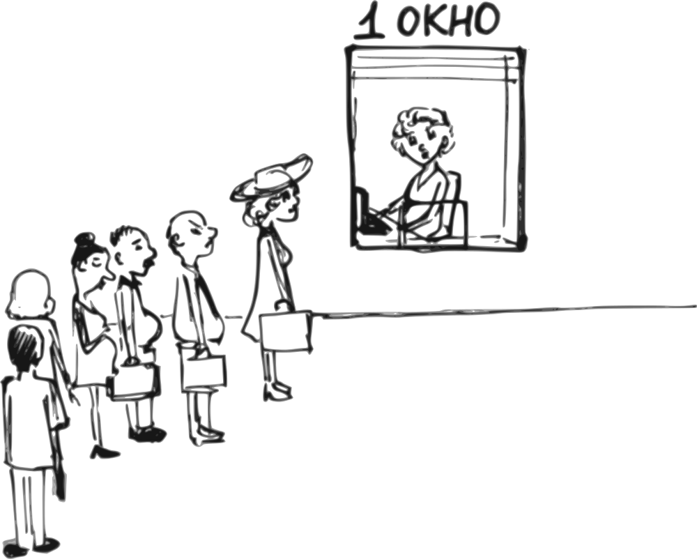

<h1 style='text-align: center;'> B. The Queue</h1>

<h5 style='text-align: center;'>time limit per test: 1 second</h5>
<h5 style='text-align: center;'>memory limit per test: 256 megabytes</h5>

Finally! Vasya have come of age and that means he can finally get a passport! To do it, he needs to visit the passport office, but it's not that simple. There's only one receptionist at the passport office and people can queue up long before it actually opens. Vasya wants to visit the passport office tomorrow.

He knows that the receptionist starts working after *t**s* minutes have passed after midnight and closes after *t**f* minutes have passed after midnight (so that (*t**f* - 1) is the last minute when the receptionist is still working). The receptionist spends exactly *t* minutes on each person in the queue. If the receptionist would stop working within *t* minutes, he stops serving visitors (other than the one he already serves). 

Vasya also knows that exactly *n* visitors would come tomorrow. For each visitor Vasya knows the point of time when he would come to the passport office. Each visitor queues up and doesn't leave until he was served. If the receptionist is free when a visitor comes (in particular, if the previous visitor was just served and the queue is empty), the receptionist begins to serve the newcomer immediately.

  "Reception 1" For each visitor, the point of time when he would come to the passport office is positive. Vasya can come to the office at the time zero (that is, at midnight) if he needs so, but he can come to the office only at integer points of time. If Vasya arrives at the passport office at the same time with several other visitors, he yields to them and stand in the queue after the last of them.

Vasya wants to come at such point of time that he will be served by the receptionist, and he would spend the minimum possible time in the queue. Help him!

## Input

The first line contains three integers: the point of time when the receptionist begins to work *t**s*, the point of time when the receptionist stops working *t**f* and the time the receptionist spends on each visitor *t*. The second line contains one integer *n* — the amount of visitors (0 ≤ *n* ≤ 100 000). The third line contains positive integers in non-decreasing order — the points of time when the visitors arrive to the passport office.

All times are set in minutes and do not exceed 1012; it is guaranteed that *t**s* < *t**f*. It is also guaranteed that Vasya can arrive at the passport office at such a point of time that he would be served by the receptionist.

## Output

Print single non-negative integer — the point of time when Vasya should arrive at the passport office. If Vasya arrives at the passport office at the same time with several other visitors, he yields to them and queues up the last. If there are many answers, you can print any of them.

## Examples

## Input


```
10 15 2  
2  
10 13  

```
## Output


```
12
```
## Input


```
8 17 3  
4  
3 4 5 8  

```
## Output


```
2
```
## Note

In the first example the first visitor comes exactly at the point of time when the receptionist begins to work, and he is served for two minutes. At 12 minutes after the midnight the receptionist stops serving the first visitor, and if Vasya arrives at this moment, he will be served immediately, because the next visitor would only come at 13 minutes after midnight.

In the second example, Vasya has to come before anyone else to be served. 


#### tags 

#2100 #brute_force #greedy 