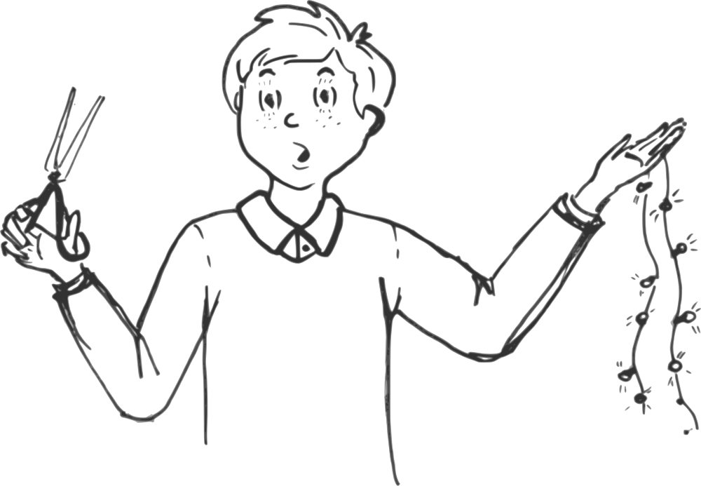
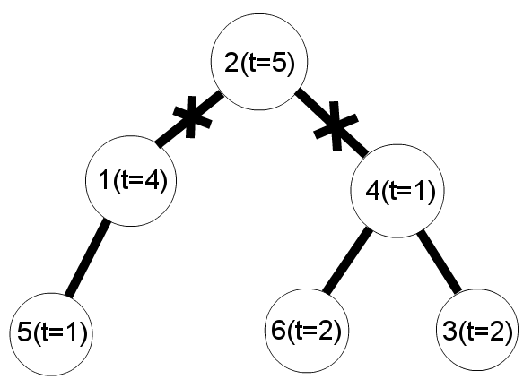

<h1 style='text-align: center;'> C. Garland</h1>

<h5 style='text-align: center;'>time limit per test: 2 seconds</h5>
<h5 style='text-align: center;'>memory limit per test: 256 megabytes</h5>

Once at New Year Dima had a dream in which he was presented a fairy garland. A garland is a set of lamps, some pairs of which are connected by wires. Dima remembered that each two lamps in the garland were connected directly or indirectly via some wires. Furthermore, the number of wires was exactly one less than the number of lamps.

There was something unusual about the garland. Each lamp had its own brightness which depended on the temperature of the lamp. Temperatures could be positive, negative or zero. Dima has two friends, so he decided to share the garland with them. He wants to cut two different wires so that the garland breaks up into three parts. Each part of the garland should shine equally, i. e. the sums of lamps' temperatures should be equal in each of the parts. Of course, each of the parts should be non-empty, i. e. each part should contain at least one lamp.

  Help Dima to find a suitable way to cut the garland, or determine that this is impossible.

While examining the garland, Dima lifted it up holding by one of the lamps. Thus, each of the lamps, except the one he is holding by, is now hanging on some wire. So, you should print two lamp ids as the answer which denote that Dima should cut the wires these lamps are hanging on. Of course, the lamp Dima is holding the garland by can't be included in the answer.

## Input

The first line contains single integer *n* (3 ≤ *n* ≤ 106) — the number of lamps in the garland.

Then *n* lines follow. The *i*-th of them contain the information about the *i*-th lamp: the number lamp *a**i*, it is hanging on (and 0, if is there is no such lamp), and its temperature *t**i* ( - 100 ≤ *t**i* ≤ 100). The lamps are numbered from 1 to *n*.

## Output

If there is no solution, print -1.

Otherwise print two integers — the indexes of the lamps which mean Dima should cut the wires they are hanging on. If there are multiple answers, print any of them.

## Examples

## Input


```
6  
2 4  
0 5  
4 2  
2 1  
1 1  
4 2  

```
## Output


```
1 4  

```
## Input


```
6  
2 4  
0 6  
4 2  
2 1  
1 1  
4 2  

```
## Output


```
-1  

```
## Note

The garland and cuts scheme for the first example:

  

#### tags 

#2000 #dfs_and_similar #graphs #greedy #trees 