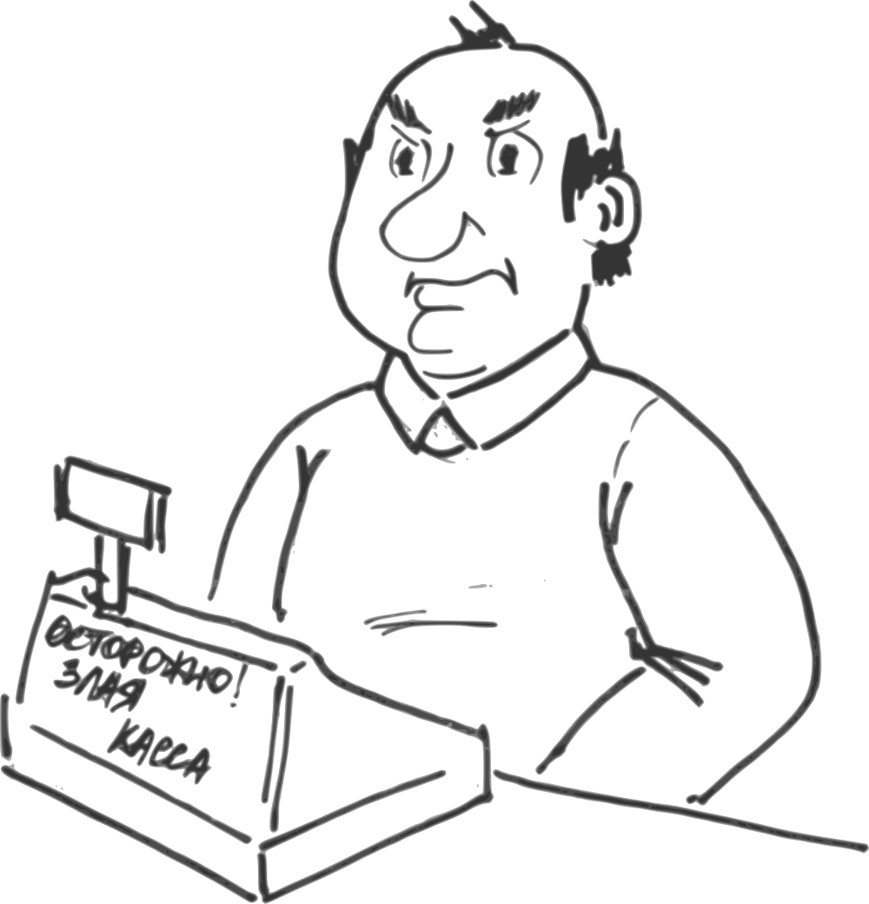

<h1 style='text-align: center;'> E. Change-free</h1>

<h5 style='text-align: center;'>time limit per test: 1 second</h5>
<h5 style='text-align: center;'>memory limit per test: 256 megabytes</h5>

Student Arseny likes to plan his life for *n* days ahead. He visits a canteen every day and he has already decided what he will order in each of the following *n* days. Prices in the canteen do not change and that means Arseny will spend *c**i* rubles during the *i*-th day.

There are 1-ruble coins and 100-ruble notes in circulation. At this moment, Arseny has *m* coins and a sufficiently large amount of notes (you can assume that he has an infinite amount of them). Arseny loves modern technologies, so he uses his credit card everywhere except the canteen, but he has to pay in cash in the canteen because it does not accept cards.

Cashier always asks the student to pay change-free. However, it's not always possible, but Arseny tries to minimize the dissatisfaction of the cashier. Cashier's dissatisfaction for each of the days is determined by the total amount of notes and coins in the change. To be precise, if the cashier gives Arseny *x* notes and coins on the *i*-th day, his dissatisfaction for this day equals *x*·*w**i*. Cashier always gives change using as little coins and notes as possible, he always has enough of them to be able to do this.

  "Caution! Angry cashier" Arseny wants to pay in such a way that the total dissatisfaction of the cashier for *n* days would be as small as possible. Help him to find out how he needs to pay in each of the *n* days!

Note that Arseny always has enough money to pay, because he has an infinite amount of notes. Arseny can use notes and coins he received in change during any of the following days.

## Input

The first line contains two integers *n* and *m* (1 ≤ *n* ≤ 105, 0 ≤ *m* ≤ 109) — the amount of days Arseny planned his actions for and the amount of coins he currently has. 

The second line contains a sequence of integers *c*1, *c*2, ..., *c**n* (1 ≤ *c**i* ≤ 105) — the amounts of money in rubles which Arseny is going to spend for each of the following days. 

The third line contains a sequence of integers *w*1, *w*2, ..., *w**n* (1 ≤ *w**i* ≤ 105) — the cashier's dissatisfaction coefficients for each of the following days.

## Output

In the first line print one integer — minimum possible total dissatisfaction of the cashier.

Then print *n* lines, the *i*-th of then should contain two numbers — the amount of notes and the amount of coins which Arseny should use to pay in the canteen on the *i*-th day.

Of course, the total amount of money Arseny gives to the casher in any of the days should be no less than the amount of money he has planned to spend. It also shouldn't exceed 106 rubles: Arseny never carries large sums of money with him.

If there are multiple answers, print any of them.

## Examples

## Input


```
5 42  
117 71 150 243 200  
1 1 1 1 1  

```
## Output


```
79  
1 17  
1 0  
2 0  
2 43  
2 0  

```
## Input


```
3 0  
100 50 50  
1 3 2  

```
## Output


```
150  
1 0  
1 0  
0 50  

```
## Input


```
5 42  
117 71 150 243 200  
5 4 3 2 1  

```
## Output


```
230  
1 17  
1 0  
1 50  
3 0  
2 0  

```


#### tags 

#2400 #greedy 