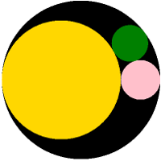
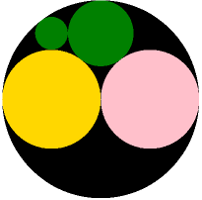

<h1 style='text-align: center;'> E. Martian Food</h1>

<h5 style='text-align: center;'>time limit per test: 1 second</h5>
<h5 style='text-align: center;'>memory limit per test: 256 megabytes</h5>

Have you ever tasted Martian food? Well, you should.

Their signature dish is served on a completely black plate with the radius of *R*, flat as a pancake.

First, they put a perfectly circular portion of the Golden Honduras on the plate. It has the radius of *r* and is located as close to the edge of the plate as possible staying entirely within the plate. I. e. Golden Honduras touches the edge of the plate from the inside. It is believed that the proximity of the portion of the Golden Honduras to the edge of a plate demonstrates the neatness and exactness of the Martians.

Then a perfectly round portion of Pink Guadeloupe is put on the plate. The Guadeloupe should not overlap with Honduras, should not go beyond the border of the plate, but should have the maximum radius. I. e. Pink Guadeloupe should touch the edge of the plate from the inside, and touch Golden Honduras from the outside. For it is the size of the Rose Guadeloupe that shows the generosity and the hospitality of the Martians.

Further, the first portion (of the same perfectly round shape) of Green Bull Terrier is put on the plate. It should come in contact with Honduras and Guadeloupe, should not go beyond the border of the plate and should have maximum radius.

Each of the following portions of the Green Bull Terrier must necessarily touch the Golden Honduras, the previous portion of the Green Bull Terrier and touch the edge of a plate, but should not go beyond the border.

To determine whether a stranger is worthy to touch the food, the Martians ask him to find the radius of the *k*-th portion of the Green Bull Terrier knowing the radii of a plate and a portion of the Golden Honduras. And are you worthy?

## Input

The first line contains integer *t* (1 ≤ *t* ≤ 104) — amount of testcases.

Each of the following *t* lines contain three positive integers: the radii of the plate and a portion of the Golden Honduras *R* and *r* (1 ≤ *r* < *R* ≤ 104) and the number *k* (1 ≤ *k* ≤ 104).

In the pretests 1 ≤ *k* ≤ 2.

## Output

Print *t* lines — the radius of the *k*-th portion of the Green Bull Terrier for each test. The absolute or relative error of the answer should not exceed 10- 6.

## Examples

## Input


```
2  
4 3 1  
4 2 2  

```
## Output


```
0.9230769231  
0.6666666667  

```
## Note

Dish from the first sample looks like this:



Dish from the second sample looks like this:




#### tags 

#2800 #geometry 