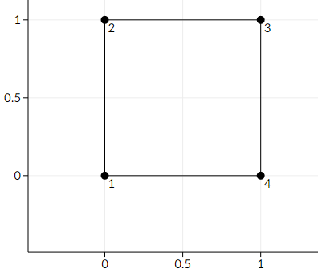
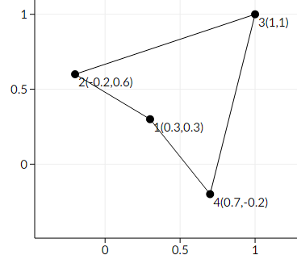

<h1 style='text-align: center;'> B. Volatile Kite</h1>

<h5 style='text-align: center;'>time limit per test: 2 seconds</h5>
<h5 style='text-align: center;'>memory limit per test: 256 megabytes</h5>

You are given a convex polygon *P* with *n* distinct vertices *p*1, *p*2, ..., *p**n*. Vertex *p**i* has coordinates (*x**i*, *y**i*) in the 2D plane. These vertices are listed in clockwise order.

You can choose a real number *D* and move each vertex of the polygon a distance of at most *D* from their original positions.

Find the maximum value of *D* such that no matter how you move the vertices, the polygon does not intersect itself and stays convex.

## Input

The first line has one integer *n* (4 ≤ *n* ≤ 1 000) — the number of vertices.

The next *n* lines contain the coordinates of the vertices. Line *i* contains two integers *x**i* and *y**i* ( - 109 ≤ *x**i*, *y**i* ≤ 109) — the coordinates of the *i*-th vertex. These points are guaranteed to be given in clockwise order, and will form a strictly convex polygon (in particular, no three consecutive points lie on the same straight line).

## Output

Print one real number *D*, which is the maximum real number such that no matter how you move the vertices, the polygon stays convex.

Your answer will be considered correct if its absolute or relative error does not exceed 10- 6.

Namely, let's assume that your answer is *a* and the answer of the jury is *b*. The checker program will consider your answer correct if .

## Examples

## Input


```
4  
0 0  
0 1  
1 1  
1 0  

```
## Output


```
0.3535533906  

```
## Input


```
6  
5 0  
10 0  
12 -4  
10 -8  
5 -8  
3 -4  

```
## Output


```
1.0000000000  

```
## Note

Here is a picture of the first sample



Here is an example of making the polygon non-convex.



This is not an optimal solution, since the maximum distance we moved one point is  ≈ 0.4242640687, whereas we can make it non-convex by only moving each point a distance of at most  ≈ 0.3535533906.


#### tags 

#1800 #geometry 